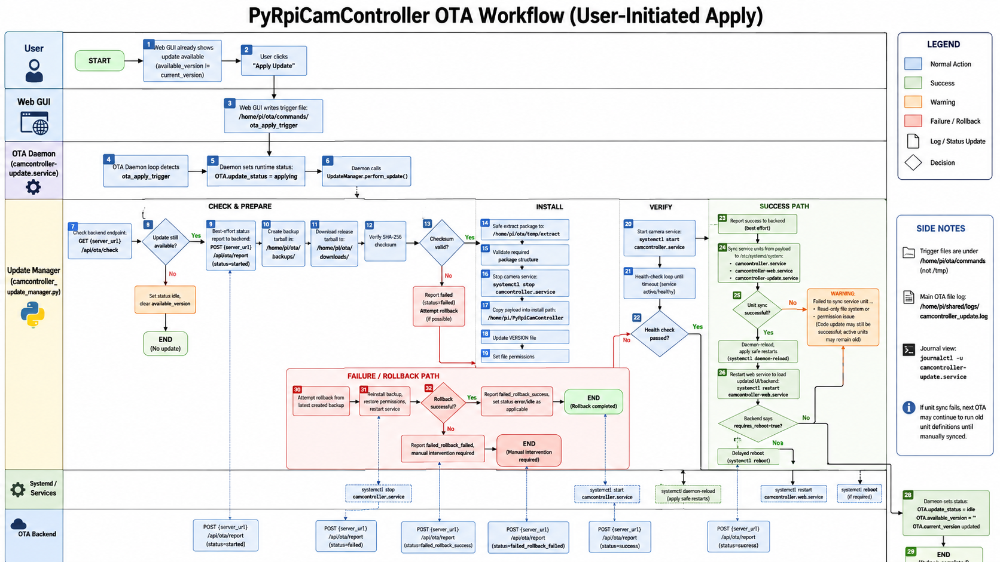

# OTA Daemon Guide

This document describes how the device-side OTA system works in PyRpiCamController.

## Scope

Device-side OTA consists of:

- `camcontroller-update.service`
- `Updates/camcontroller_update_daemon.py`
- `Updates/camcontroller_update_manager.py`

Backend-side OTA APIs and admin tools are described in architecture/backend docs.

## Service and Process Model

- Systemd unit: `camcontroller-update.service`
- Entry point: `python3 /home/pi/PyRpiCamController/Updates/camcontroller_update_daemon.py --daemon`
- Main loop behavior:
  1. Process manual trigger files first.
  2. If `OtaEnable=false`, sleep and retry.
  3. If `OtaEnable=true`, perform automatic check/apply flow based on `OTA.auto_apply`.
  4. Sleep in short increments while still honoring manual triggers quickly.

## Important Paths

- OTA base dir: `/home/pi/ota`
- Command dir: `/home/pi/ota/commands`
- Manual check trigger: `/home/pi/ota/commands/ota_check_trigger`
- Manual apply trigger: `/home/pi/ota/commands/ota_apply_trigger`
- Downloads: `/home/pi/ota/downloads`
- Backups: `/home/pi/ota/backups`
- Temporary extract dir: `/home/pi/ota/temp`
- OTA log file: `/home/pi/shared/logs/camcontroller_update.log`

## Settings Used by OTA

Top-level:

- `OtaEnable` (bool): master OTA enable switch.

`OTA.*`:

- `server_url`
- `api_key`
- `check_interval`
- `auto_apply`
- `service_name`
- `install_path`
- `backup_retention`
- `health_check_timeout`
- `download_timeout`

Runtime status fields updated by daemon/web:

- `OTA.current_version`
- `OTA.available_version`
- `OTA.last_check`
- `OTA.update_status` (`idle`, `checking`, `available`, `applying`, `error`)
- `OTA.changelog`

## Automatic vs Manual Mode

### Automatic check only (recommended)

- `OtaEnable=true`
- `OTA.auto_apply=false`

Behavior:

- Daemon checks for updates on schedule.
- If update exists, marks `OTA.available_version` and `OTA.update_status=available`.
- Apply is user-triggered from Web UI or manual trigger file.

### Automatic check + apply

- `OtaEnable=true`
- `OTA.auto_apply=true`

Behavior:

- Daemon runs full `perform_update()` when checks occur.

## Update Transaction Flow

`UpdateManager.perform_update()` sequence:

1. Check backend `/api/ota/check`.
2. Report `started` state to backend (`/api/ota/report`) best effort.
3. Create backup tarball from current install.
4. Download package.
5. Verify SHA-256 checksum (if provided).
6. Extract package safely (path traversal blocked).
7. Validate expected package structure.
8. Stop target service (`camcontroller.service` by default).
9. Copy update payload into install path.
10. Update `VERSION`.
11. Start service and verify health until timeout.
12. If verification fails, rollback from backup.
13. Sync changed service unit files to `/etc/systemd/system`.
14. Restart web service to load updated Web UI code.
15. Reboot only if backend marks `requires_reboot=true`.

## Service Unit Sync Behavior

After a successful update, the manager attempts to sync:

- `camcontroller.service`
- `camcontroller-web.service`
- `camcontroller-update.service`

from project `Services/` into `/etc/systemd/system`.

If writes to `/etc/systemd/system` fail with read-only/permission errors, OTA code may still update successfully, but active unit definitions may stay old until corrected.

## Filesystem / Unit-Sync Decision Tree

Use this decision tree when the update log shows a unit-sync warning or the customer reports a read-only filesystem:

1. **Did OTA code update complete successfully?**

   - Yes → continue.
   - No → treat as a normal OTA failure or rollback case.

2. **Did syncing one or more service units fail with `Read-only file system` or permission errors?**

   - Yes → the OTA payload likely installed, but unit definitions may not have been written into `/etc/systemd/system`.
   - No → unit sync likely succeeded; no special repair path needed.

3. **Is the failure limited to `/etc/systemd/system`, while the rest of the system is writable?**

   - Yes → this is usually a service/unit write-path issue. The repair helper can retry on the next boot and then run `daemon-reload`.
   - No → if other writes also fail, suspect broader filesystem damage.

4. **Do other logs show ext4/mmc/I/O/read-only symptoms?**

   - Yes → treat as an underlying storage problem (often SD card / filesystem health), not just an OTA packaging issue.
   - No → the issue may be transient or sandbox-related; a reboot + repair retry is appropriate.

5. **After reboot, did the boot-time unit repair helper sync the files?**

   - Yes → the new unit files are now active.
   - No → the filesystem may still be read-only or otherwise damaged.

### Practical interpretation

- **Transient unit-sync failure**: OTA can usually recover on the next boot.
- **True read-only filesystem**: OTA can report the problem, but it cannot fix the underlying storage issue by itself.
- **Repeated unit-sync failure**: strong signal that the device needs filesystem/storage investigation.

## Manual Trigger Files

The daemon watches for trigger files in `/home/pi/ota/commands`:

```bash
echo "manual check" | sudo tee /home/pi/ota/commands/ota_check_trigger
echo "manual apply" | sudo tee /home/pi/ota/commands/ota_apply_trigger
```

Then inspect logs:

```bash
sudo journalctl -u camcontroller-update.service -n 120 --no-pager
tail -n 200 /home/pi/shared/logs/camcontroller_update.log
```

## Observability and Logs

Primary OTA logs:

- File: `/home/pi/shared/logs/camcontroller_update.log`
- Journal: `journalctl -u camcontroller-update.service`

Common useful markers in logs:

- `Checking for updates:`
- `Update available:`
- `Checksum verification passed`
- `Update verification successful`
- `Starting rollback procedure`
- `Failed to sync service unit ...`

## Frequent Failure Modes

### 1) `cpu_id=unknown` / 401 unauthorized

Root cause: daemon cannot read CPU serial from `/proc/cpuinfo` (sandboxing mismatch) or backend key mismatch.

### 2) DNS/network failures to OTA backend

Symptom: `Temporary failure in name resolution`, connection errors.

### 3) Unit sync write failures to `/etc/systemd/system`

Symptom: `Read-only file system` or permission errors when syncing `camcontroller-*.service`.

Impact: code update may succeed, but active service unit definitions can remain old.

### 4) Health check failure after install

Symptom: update verify timeout/failure followed by rollback attempt.

## One-Time Unit Sync Repair (if needed)

If logs show service-unit sync failures, repair manually:

```bash
sudo install -m 644 /home/pi/PyRpiCamController/Services/camcontroller-web.service /etc/systemd/system/camcontroller-web.service
sudo install -m 644 /home/pi/PyRpiCamController/Services/camcontroller-update.service /etc/systemd/system/camcontroller-update.service
sudo systemctl daemon-reload
sudo systemctl restart camcontroller-web.service camcontroller-update.service
```

Then verify unit content parity:

```bash
sudo cmp -s /home/pi/PyRpiCamController/Services/camcontroller-web.service /etc/systemd/system/camcontroller-web.service && echo web:SYNCED
sudo cmp -s /home/pi/PyRpiCamController/Services/camcontroller-update.service /etc/systemd/system/camcontroller-update.service && echo update:SYNCED
```

## Web UI Interaction Model

- Status tab reads `OTA.*` runtime fields.
- `Check for Updates` writes check trigger and/or performs direct check logic.
- `Apply Update` writes apply trigger.
- Daemon performs actual update transaction.

## Operational Recommendation

For production fleets:

- Keep `OTA.auto_apply=false` unless rollout controls are very strict.
- Use staged release channels and canary devices.
- Treat unit-sync warnings as high-priority maintenance signals.
- Keep backups enabled and monitor rollback events.

## Release Channels and Test Devices

The actual rollout controls live on the server side in the OTA admin dashboard:

- Upload releases in `backend/Updates/admin/admin_dashboard.php`.
- Assign each release to `stable`, `testing`, or `beta`.
- Promote a release from `draft` to `testing` or `stable` only after validation.
- Assign devices to a channel in the admin dashboard as well.

Device-side test mode is separate:

- `TestDevice=true` on the Pi unlocks the `development` update group locally.
- `UpdateGroup` is written during enrollment/provisioning and controls which local update group the device uses.
- Use `--test-device` and `--update-group` in `tools/secure_enroll_device.py` when enrolling a test Pi.

Recommended rollout flow:

1. Upload a new release as `testing` or `beta`.
2. Set one or more canary devices to the matching channel.
3. Validate OTA download, install, health check, and reboot behavior.
4. Promote the release to `stable` after validation.
5. Keep normal fleet devices on `stable` and reserve `development` for explicit test devices only.

## Flowchart Reference

The full OTA workflow flowchart image is embedded below:



The flowchart covers the user-clicked apply path, backend check, download, checksum, install, verification, unit sync, reboot-required repair path, rollback, and final success/failure states.
