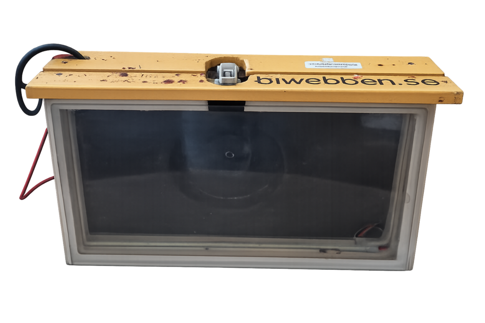

# PyRpiCamController

A modern Python camera control system for Raspberry Pi with a web interface, designed for research, time-lapse photography, and automated image collection.

**First Release**: This release delivers a stable and practical baseline for Raspberry Pi camera deployments, including capture, streaming, web-based configuration, and network file sharing. It is intended for real-world use while selected advanced vision features continue to mature.

[](https://python.org)
[](https://raspberrypi.org)
[](LICENSE)

## 🎯 What is PyRpiCamController?

A comprehensive camera control system originally developed for bee research and machine-learning data collection. The system provides:

- **Automated Photography**: Configurable time-lapse
- **Live Streaming**: Real-time video streaming with web viewer
- **Web Interface**: Modern browser-based configuration and control
- **Motion-Aware Processing**: Detect and annotate movement in the vision pipeline
- **Hardware Integration**: LED lighting control and status indicators
- **Research Ready**: Metadata collection and backend data posting

It is well suited for wildlife monitoring, time-lapse projects, security applications, and other automated photography needs.

If you like the project and want to support it, consider donating a small amount via [PayPal](https://www.paypal.com/donate/?business=6X9PRDMLYC4NN&no_recurring=1&currency_code=SEK)

## 📋 Table of Contents

- [Features](#features)
- [Quick Start](#quick-start)
- [Release Readiness Checklist](#-release-readiness-checklist)
- [Release Notes](#-release-notes)
- [Documentation](#documentation)
- [API](#api)
- [Hardware Support](#hardware-support)
- [Contributing](#contributing)
- [Examples](#examples)
- [Hardware Gallery](#hardware-gallery)

## 🗺️ Setup & Operation Flow

Click the image to open full size:

<a href="_doc/Setup-and-operation-flow.png">
   
</a>

## ✨ Features

### Core Functionality
* **Multi-Camera Support**: Raspberry Pi Camera Module 2/3, HQ Camera, and USB webcam fallback
* **Unified Settings System**: JSON schema-based configuration with web interface
* **Real-time Streaming**: Live video with configurable resolution and framerate
* **Smart Scheduling**: Time-based capture with customizable intervals
* **Vision Pipeline**: Pluggable image processing pipeline (base pipeline enabled)
* **Temperature Monitoring**: CPU thermal management with automatic cooling
* **Built-in Network Storage**: Automatic file sharing for images and logs

### Advanced Features
* **Web Configuration**: Browser-based settings management with auto-save
* **RESTful API**: Programmatic control and integration
* **Multi-destination Logging**: File, console, and HTTP backend logging
* **Hardware Control**: PWM lighting (2500Hz flicker-free) and RGB status LEDs (needs auxiliary hardware)
* **Network Management**: WiFi setup via captive portal (zero-touch configuration)
* **Service Integration**: Systemd services for production deployment
* **Research Features**: Metadata collection, backend posting, structured logging

### Default-Enabled In This Release
These features are enabled by default in `Settings/settings_schema.json`:

* **File publishing enabled** (`Cam.publishers.file.publish = true`)
* **Disk space management enabled** (`storage_management.enabled = true`)
* **File logging enabled** (`LogToFile = true`)
* **Vision framework enabled** (`Vision.enabled = true`)

OTA-related configuration, service files, and web endpoints are present for development and future rollout, but OTA updates are not supported for production use in this release.

### Technical Highlights
* **Modular Architecture**: Easy to add new camera types, publishing targets, and image processing steps  
* **High Performance**: Concurrent streaming with efficient resource usage
* **Production Ready**: Service deployment with monitoring and auto-restart 
* **All Python**: Easy-to-follow, well-documented, open-source code

### Auxiliary control hardware
* PWM-controlled LED lighting (flicker-free 2500Hz)
* Addressable RGB status indicators  
* Temperature sensors for environmental monitoring
* Fixed KiCAD drawings will be available soon. 

## 🚀 Quick Start

**Prerequisites**: Raspberry Pi (3B+, 4B, or 5) with camera module, WiFi, and USB boot capability

1. **Get the Code**:
   ```bash
   git clone https://github.com/teddycool/PyRpiCamController.git
   cd PyRpiCamController
   ```

2. **Install**: Copy to your Pi (running from USB drive) and run the installer:
   ```bash
   scp -r PyRpiCamController pi@your-pi-ip:~/
   ssh pi@your-pi-ip
   cd PyRpiCamController && python3 tools/install-all-optimized.py
   ```

3. **Configure**: Access the web interface at `http://your-pi-ip`

4. **Monitor**: Check status with `sudo systemctl status camcontroller.service`

📖 **Need detailed setup instructions?** → [INSTALLATION.md](INSTALLATION.md)

## ✅ Release Readiness Checklist

Use this checklist before tagging the first public release:

- Verify installation flow on Raspberry Pi 3B+, 4B, and 5 from a clean USB boot image.
- Verify first-boot WiFi onboarding via Comitup (`comitup-<nnn>` SSID and `http://10.41.0.1`).
- Verify Web UI workflow: setting changes, pending-change indicator, apply-and-restart.
- Verify camera mode behavior: photo mode saves files, stream mode starts and serves video.
- Verify SMB access from Windows/macOS/Linux using the `shared` share name.
- Verify image and log paths are writable/deletable and disk free space is visible in the Web UI.
- Verify required services are active (`camcontroller.service`, `camcontroller-web.service`, SMB/Avahi as applicable).
- Verify startup self-heal runs (shared folder ownership/permissions restored after unclean power loss).
- Confirm OTA is treated as unsupported for production in this release.
- Confirm documentation links and examples match shipped configuration.

Recommended smoke test commands:

```bash
sudo systemctl status camcontroller.service camcontroller-web.service
hostname -I
ls -lah /home/pi/shared/
journalctl -u camcontroller.service -n 100 --no-pager
```

## 📝 Release Notes

- Draft release notes: [RELEASE_NOTES.md](RELEASE_NOTES.md)

## 📚 Documentation

| Document | Description |
|----------|-------------|
| [INSTALLATION.md](INSTALLATION.md) | Complete installation guide with WiFi setup |
| [USER_GUIDE.md](USER_GUIDE.md) | End-user guide (English) |
| [USER_GUIDE_SWE.md](USER_GUIDE_SWE.md) | Användarguide (Svenska) |
| [ARCHITECTURE.md](ARCHITECTURE.md) | Technical architecture and design details |
| [UNIFIED_SETTINGS_GUIDE.md](Settings/UNIFIED_SETTINGS_GUIDE.md) | Unified settings system documentation |
| [SMB_FILE_SHARING.md](SMB_FILE_SHARING.md) | SMB file sharing setup and troubleshooting guide |

## API

The web interface uses an internal HTTP API on the same host. Main endpoints currently exposed by the backend include:

- `GET /api/stream/status`
- `POST /api/settings`
- `POST /api/settings/update`
- `GET /api/settings/pending`
- `POST /api/service/apply-and-restart`
- `GET /api/updates/status`
- `POST /api/updates/check`
- `POST /api/updates/apply`
- `GET /api/updates/changelog`
- `POST /api/updates/backup`

These endpoints are primarily intended for the bundled Web UI. Treat them as internal interfaces unless you control both client and deployment.

## 🔧 Hardware Support

### Currently Supported Cameras
- **Raspberry Pi Camera Module 2**: Supported via Picamera2
- **Raspberry Pi Camera Module 3**: Full resolution (4608x2592), autofocus
- **Raspberry Pi High Quality Camera**: Interchangeable lenses, high sensitivity
- **USB WebCam**: Fallback option for compatible USB cameras

### Supported Boards  
- **Raspberry Pi 3B+**: USB boot capable (recommended starting point)
- **Raspberry Pi 4B**: All variants with USB 3.0 boot support
- **Raspberry Pi 5**: Full USB boot support

**Note**: Raspberry Pi Zero models and 3B (non-+) are **not supported** out of the box because they cannot boot directly from USB.

### Storage Requirements
- **High-Performance USB Drive**: SanDisk Ultra Fit 32GB+ or similar is recommended
- **USB 3.0+ Support**: For optimal performance with image processing
- **No SD Card**: System runs entirely from USB for superior performance and reliability

### Built-in Network Storage (SMB)
- **Built-in SMB Server**: Automatic file sharing for images and logs
- **Guest Access**: No authentication required for easy access
- **Cross-Platform**: Access from Windows, Mac or Linux via network share
- **Auto-Configuration**: Setup handled by installation script
- **Network Discovery**: Automatic appearance in file explorers

📖 **Detailed SMB Guide**: [SMB_FILE_SHARING.md](SMB_FILE_SHARING.md) - Complete setup and troubleshooting


## 🤝 Contributing

Contributions are very welcome. **Before starting development work, please read [CONTRIBUTING.md](CONTRIBUTING.md)** for guidelines on code patterns, documentation, testing, and commit messages.

### 📖 Developer Resources

- **[CONTRIBUTING.md](CONTRIBUTING.md)** — Development guidelines for all contributors (human and AI)
- **[.dev-guidelines/](.dev-guidelines/)** — Detailed technical guidelines:
  - [DESIGN_PATTERNS.md](.dev-guidelines/DESIGN_PATTERNS.md) — Code patterns used in this project
  - [DOCUMENTATION_SYNC.md](.dev-guidelines/DOCUMENTATION_SYNC.md) — When and how to update docs
  - [INSTALLER_UPDATES.md](.dev-guidelines/INSTALLER_UPDATES.md) — Keeping installer current
  - Plus guides on testing, Swedish translations, file permissions, and git workflow

### Ways to contribute

- 🐛 **Report Issues**: Bug reports, feature requests, and feedback
- 💡 **Feature Requests**: New camera types, processing features, hardware integrations
- 🔧 **Pull Requests**: Code contributions (one feature per PR for easier review; follow [CONTRIBUTING.md](CONTRIBUTING.md))
- 📚 **Documentation**: Improvements to guides and technical documentation
- 🧪 **Testing**: Hardware compatibility testing across Pi models

### Development Focus Areas

- Additional camera support (Arducam, USB cameras)
- Advanced computer vision features (YOLO integration)
- Home Assistant sensor integration
- OTA update system (planned)
- Enhanced vision processing pipeline

### For AI Coding Assistants

If you're an AI tool (GitHub Copilot, Claude, etc.), **read [.dev-guidelines/AI_INSTRUCTIONS.md](.dev-guidelines/AI_INSTRUCTIONS.md)** before making any changes. Key rules summary:
1. Use existing code patterns (state machine, publishers, factory, pipeline)
2. Update documentation when code changes
3. Keep installer script (`tools/install-all-optimized.py`) current
4. Test before commit
5. Use atomic writes for file persistence
6. Clean breaks (no backwards compatibility unless requested)

## 🌟 Examples

Real-world applications of PyRpiCamController:

### 🐝 Beehive Monitoring

**Inside Hive Camera**: Raspberry Pi 3B+ with PiCam3 wide lens and autofocus. Integrated light box and status LED for low-disturbance monitoring. USB storage for reliable 24/7 operation.
[Buy a pre-built beehive camera](https://www.sensorwebben.se/kamera-bikupa/)

**Entrance Monitoring**: Raspberry Pi 4B with PiCam3 in weatherproof enclosure. Status LED and SMB file sharing for remote access to entrance activity data.


### 🌸 Natural Science Research

**Flower Visitor Documentation**: Raspberry Pi 3B+ with PiCamHQ for high-quality macro photography. Ideal for documenting insect behavior and plant interactions.

### 🔬 General Research Applications

- Wildlife monitoring with motion detection
- Time-lapse plant growth studies  
- Laboratory equipment monitoring
- Security and surveillance

## 📸 Hardware Gallery

### Raspberry Pi 3B+ with Camera Module 3


### Raspberry Pi with HQ Camera


### Inside beehive cam


### Deployed Beehive Camera Systems


---

## 📄 License

This project is licensed under the GNU General Public License v3.0 - see the [LICENSE](LICENSE) file for details.

## 🙋‍♂️ Support

For questions, issues, or contributions:
- 📧 **Issues**: [GitHub Issues](https://github.com/teddycool/PyRpiCamController/issues)
- 🤝 **Discussions**: [GitHub Discussions](https://github.com/teddycool/PyRpiCamController/discussions) 
- 💻 **Technical Details**: See [ARCHITECTURE.md](ARCHITECTURE.md) for implementation details
- 🔧 **Installation Help**: See [INSTALLATION.md](INSTALLATION.md) for step-by-step setup