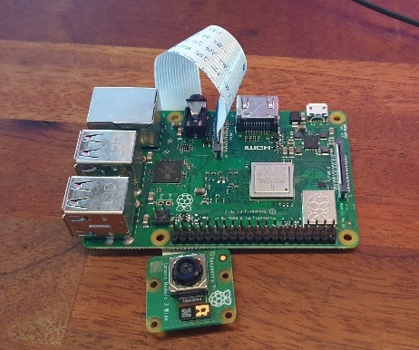
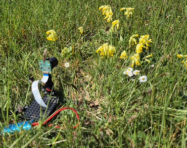
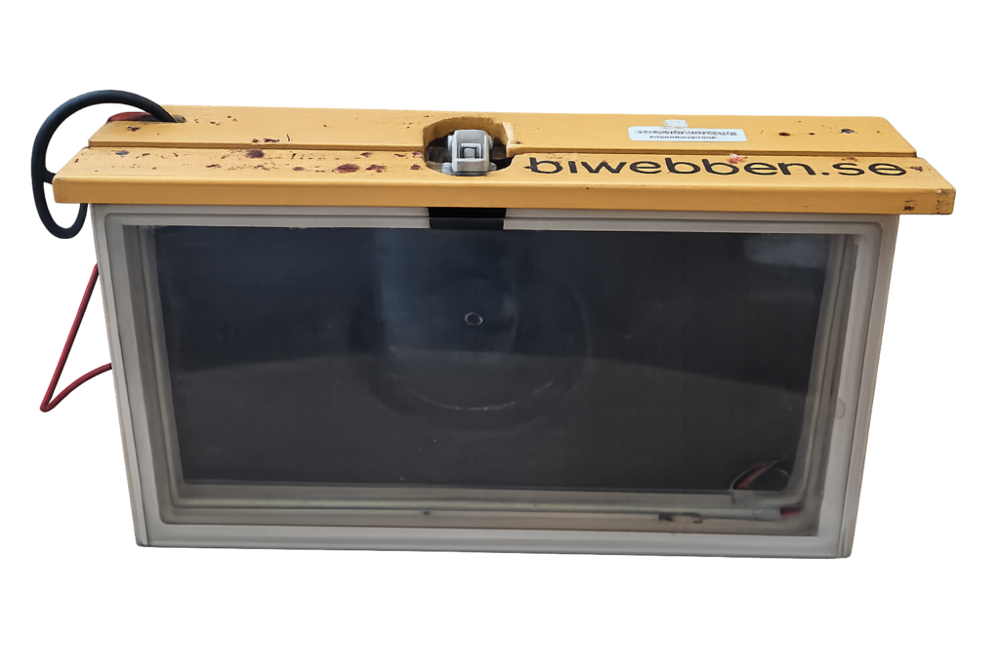
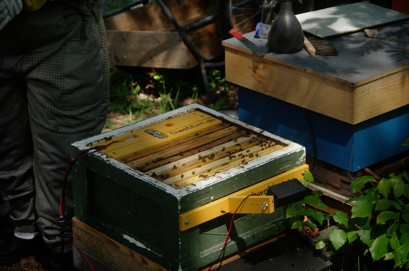

# PyRpiCamController

A modern Python camera control system for Raspberry Pi with a web interface, designed for research, time-lapse photography, and automated image collection.

**Production Baseline**: This release provides secure provisioning, OTA support, capture, streaming, web-based configuration, and network file sharing for Raspberry Pi deployments.

[](https://python.org)
[](https://raspberrypi.org)
[](LICENSE)

## What Is PyRpiCamController?

PyRpiCamController was originally developed for bee research and machine-learning data collection.

- Automated photography with configurable intervals
- Live streaming with web viewer
- Browser-based configuration and control
- Motion-aware vision pipeline support
- Hardware integration for light and status indicators
- Metadata collection and backend posting support

Use cases include wildlife monitoring, time-lapse projects, security applications, and other automated photography setups.

If you want to support the project, consider donating via [PayPal](https://www.paypal.com/donate/?business=6X9PRDMLYC4NN&no_recurring=1&currency_code=SEK).

## Table of Contents

- [Features](#features)
- [Setup and Operation Flow](#setup-and-operation-flow)
- [Quick Start](#quick-start)
- [Release Readiness Checklist](#release-readiness-checklist)
- [Release Notes](#release-notes)
- [Documentation](#documentation)
- [API](#api)
- [Hardware Support](#hardware-support)
- [Contributing](#contributing)
- [Examples](#examples)
- [Hardware Gallery](#hardware-gallery)
- [License](#license)
- [Support](#support)

## Setup and Operation Flow

[](_doc/Setup-and-operation-flow--v2.png)

## Features

### Core Functionality

- Multi-camera support (PiCam2, PiCam3, PiCamHQ)
- Unified settings system with schema-backed validation
- Real-time streaming with configurable resolution and framerate
- Time-based capture scheduling
- Pluggable vision pipeline
- CPU and environmental temperature monitoring
- Built-in network file sharing for images/logs

### Advanced Features

- Web configuration with auto-save and apply/restart workflow
- Internal REST API for UI integration
- Multi-destination logging (console/file/HTTP)
- Hardware control for light and status LEDs
- WiFi onboarding via captive portal flow
- YouTube Live publishing via RTMPS with configurable bitrate and FPS
- Systemd service integration for production operation

### Default Settings in This Release

Defaults are defined in `Settings/settings_schema.json`.

- File publishing enabled (`Cam.publishers.file.publish = true`)
- Disk space management enabled (`storage_management.enabled = true`)
- File logging enabled (`LogToFile = true`)
- Vision framework enabled (`Vision.enabled = true`)

### Technical Highlights

- Modular architecture for cameras, publishers, and processors
- Concurrent streaming and service-based deployment
- Restart-safe settings persistence
- All-Python implementation with clear structure
- YouTube Live uses an async frame queue and a stable libx264 software encode path on Raspberry Pi

### YouTube Live Summary

YouTube Live is configured under **Camera → Advanced** in the Web GUI.

YouTube Live publishing is currently available when the camera is running in Stream mode; in Cam mode the publisher stays inactive.

- `publish` enables or disables publishing
- `rtmps_url` stores the YouTube RTMPS ingest URL
- `stream_key` is stored as a hidden password field
- `bitrate` supports `1500k`, `2500k`, `4000k`, and `6000k`
- `fps` supports `5`, `10`, `15`, and `20`

Recommended starting values for Raspberry Pi 3B+:

- bitrate: `1500k`
- fps: `10`

The production stream path currently uses FFmpeg + RTMPS with `libx264` and `ultrafast` for reliability. Hardware H.264 acceleration is not required for normal operation.

## Quick Start

**Prerequisites**: Raspberry Pi 3B+, 4B, or 5 with camera module, WiFi, and USB boot capability.

### Recommended: Fresh Pi Provisioning (Release-Based)

Use this as the default production setup path. Run from your dev machine and provision a fresh Pi over SSH.

**Important:** This path requires a working OTA backend and enrollment endpoint because provisioning includes secure device enrollment.

1. **Provision fresh Pi from a release**

   ```bash
   python3 tools/provision_fresh_pi.py <pi_ip> <release_version> "<device_name>" "<location>" --non-interactive
   ```

   Example:

   ```bash
      python3 tools/provision_fresh_pi.py 192.168.1.50 1.2.0 "Camera-Front" "Entryway" \
         --non-interactive --ssh-pubkey ~/.ssh/id_ed25519.pub --ssh-posture key-only
   ```

2. **Configure**

   Open `http://your-pi-ip`.

3. **Monitor service status**

   ```bash
   ssh pi@your-pi-ip "sudo systemctl status camcontroller.service camcontroller-update.service --no-pager"
   ```

### Alternative: Manual Source Installation (Advanced)

Use this only for development/debugging scenarios where source-level editing on the Pi is required.

Use this path when:

- you are testing without a backend,
- your backend is temporarily unavailable, or
- you want to run the software locally without OTA enrollment.

1. **Get the code**

   ```bash
   git clone https://github.com/teddycool/PyRpiCamController.git
   cd PyRpiCamController
   ```

2. **Install on the Pi**

   ```bash
   scp -r PyRpiCamController pi@your-pi-ip:~/
   ssh pi@your-pi-ip
   cd PyRpiCamController
   python3 tools/install-all-optimized.py
   ```

3. **Configure**

   Open `http://your-pi-ip`.

4. **Monitor service status**

   ```bash
   sudo systemctl status camcontroller.service
   ```

Need full setup details? See [INSTALLATION.md](INSTALLATION.md).

## Secure OTA Onboarding (Real Cameras)

For production camera rollout, use the secure enroll flow from your dev/admin computer.

- New tool: `tools/secure_enroll_device.py`
- Admin credentials stay on dev machine only (env vars or prompt)
- Pi receives only its own device API key

Example:

```bash
export OTA_ADMIN_USERNAME=admin
export OTA_ADMIN_PASSWORD='***'

python3 tools/secure_enroll_device.py \
   --host 192.168.68.200 \
   --ssh-user pi \
   --name "Kitchen Cam" \
   --location "Kitchen" \
   --channel stable \
   --update-group production
```

Recommended channel model:

- Most devices: backend channel `stable`, update group `production`
- 1–2 test devices only: backend channel `testing`/`beta`, update group `development`

## Release Readiness Checklist

- Validate installer on Raspberry Pi 3B+, 4B, and 5
- Verify first-boot WiFi onboarding via Comitup
- Verify Web UI settings workflow and apply/restart behavior
- Verify camera mode and stream mode behavior
- Verify SMB access for images and logs
- Verify required services are active
- Verify startup self-heal behavior after unclean shutdown

Recommended smoke tests:

```bash
sudo systemctl status camcontroller.service camcontroller-web.service
hostname -I
ls -lah /home/pi/shared/
journalctl -u camcontroller.service -n 100 --no-pager
```

## Release Notes

- Current release notes: [RELEASE_NOTES.md](RELEASE_NOTES.md)

## Documentation

- [INSTALLATION.md](INSTALLATION.md) — Installation and setup
- [USER_GUIDE.md](USER_GUIDE.md) — End-user guide (English)
- [USER_GUIDE_SWE.md](USER_GUIDE_SWE.md) — End-user guide (Swedish)
- [ARCHITECTURE.md](ARCHITECTURE.md) — Technical architecture
- [Settings/UNIFIED_SETTINGS_GUIDE.md](Settings/UNIFIED_SETTINGS_GUIDE.md) — Settings system
- [SMB_FILE_SHARING.md](SMB_FILE_SHARING.md) — SMB setup and troubleshooting

## API

Main backend endpoints used by the bundled Web UI:

- `GET /api/stream/status`
- `POST /api/settings`
- `POST /api/settings/update`
- `GET /api/settings/pending`
- `POST /api/service/apply-and-restart`
- `GET /api/updates/status`
- `POST /api/updates/check`
- `POST /api/updates/apply`
- `GET /api/updates/changelog`
- `POST /api/updates/backup`

## Hardware Support

### Cameras

- Raspberry Pi Camera Module 2
- Raspberry Pi Camera Module 3
- Raspberry Pi High Quality Camera

Streaming in this release is optimized for Raspberry Pi camera modules using native encoded MJPEG.

### Boards

- Raspberry Pi 3B+
- Raspberry Pi 4B
- Raspberry Pi 5

## Contributing

Contributions are welcome.

- Read [CONTRIBUTING.md](CONTRIBUTING.md) before starting
- Follow patterns in [.dev-guidelines](.dev-guidelines)
- Keep docs and installer updates in sync with code changes

## Examples

- Beehive monitoring
- Flower visitor documentation
- Wildlife and laboratory monitoring
- Time-lapse studies

## Hardware Gallery






## License

Licensed under GNU GPLv3. See [LICENSE](LICENSE).

## Support

- Issues: [GitHub Issues](https://github.com/teddycool/PyRpiCamController/issues)
- Discussions: [GitHub Discussions](https://github.com/teddycool/PyRpiCamController/discussions)
- Installation help: [INSTALLATION.md](INSTALLATION.md)
- Architecture details: [ARCHITECTURE.md](ARCHITECTURE.md)
