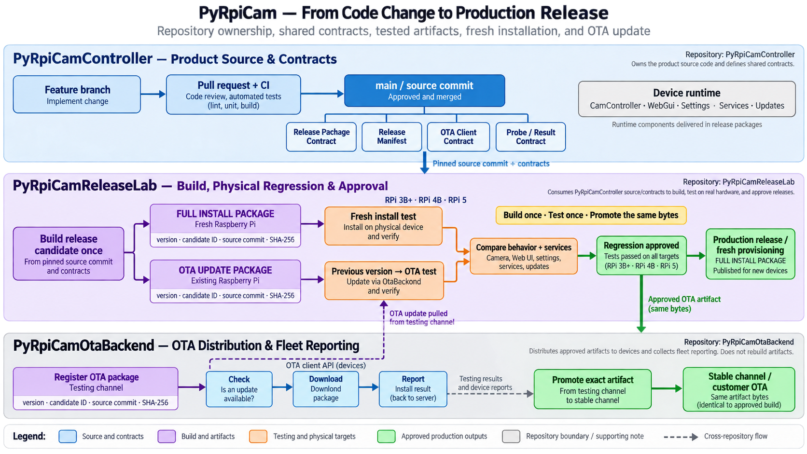

# Repository Boundaries

## Purpose and scope

### PyRpiCamController
- Owns Raspberry Pi product runtime (`CamController/`, `WebGui/`, `Settings/`, `Services/`, `Updates/`).
- Owns local installation behavior executed on the Pi (`tools/install-all-optimized.py`, service setup, local validation helpers).
- Owns public product-side contracts: package contract, OTA client contract expectations, and reusable probe/result contract used by external runners.
- Owns product unit tests and generic integration/component tests (`tests/`).

### PyRpiCamReleaseLab
- Owns release-candidate orchestration and physical-lab execution: target inventory, SSH orchestration, remote provisioning, OTA regression execution, PoE control, reporting, and promotion workflows.
- Consumes built artifacts from PyRpiCamController and test results from Pi targets.
- May call OTA backend APIs to publish/promote/validate release state but does not implement customer-facing OTA backend behavior.

### PyRpiCamOtaBackend
- Owns OTA server implementation currently represented by `backend/Updates/` (PHP API, admin UI, DB schema, release storage and channels, enrollment and OTA status reporting).
- Owns backend-side API/DB evolution and deployment concerns.
- Exposes OTA API contract to PyRpiCamController (device-side OTA client) and PyRpiCamReleaseLab (validation/promotion tooling).

## Ownership matrix

| Responsibility / component | PyRpiCamController | PyRpiCamReleaseLab | PyRpiCamOtaBackend |
|---|---|---|---|
| Camera runtime, capture loop, publishers | **Owner** | Consumer (black-box test) | No |
| Local web UI and settings editing | **Owner** | Consumer (validation) | No |
| Pi-local installer and service/unit setup | **Owner** | Triggers remotely | No |
| Device-side OTA client and daemon | **Owner** | Validates behavior | API provider only |
| OTA server API/admin/database/release hosting | No | Consumer (API) | **Owner** |
| RC orchestration, SSH target control, PoE and lab dashboards | No | **Owner** | No |
| Product unit + generic integration tests | **Owner** | Executes as consumer | No |
| Hardware-lab regression suites and target-specific scenarios | Shared probes only | **Owner** | No |
| Release candidate approval/promotion workflow | Artifact producer | **Owner** | Release channel execution |

## Allowed dependency directions

- Allowed: PyRpiCamReleaseLab → PyRpiCamController (consume artifacts, reusable probes, product contracts).
- Allowed: PyRpiCamReleaseLab → PyRpiCamOtaBackend API.
- Allowed: PyRpiCamController OTA client (`Updates/`) → PyRpiCamOtaBackend API.
- Forbidden: PyRpiCamController → PyRpiCamReleaseLab.
- Forbidden: PyRpiCamOtaBackend → lab-specific files or target inventory from PyRpiCamReleaseLab.

## Installation responsibility boundary

- PyRpiCamReleaseLab responsibilities:
  - Select target devices.
  - Connect over SSH.
  - Transfer tested artifact bytes.
  - Start installation and collect/aggregate results.
- PyRpiCamController responsibilities:
  - Define and maintain local installation rules executed on Raspberry Pi.
  - Configure services, system dependencies, and runtime permissions on-device.

## Test responsibility boundary

- Product unit tests and generic integration/component tests remain in PyRpiCamController (`tests/`).
- Hardware-lab orchestration and target-specific regression scenarios belong in PyRpiCamReleaseLab.
- Reusable probes may remain in PyRpiCamController and be invoked externally (for example `tools/test_camera_service.py`, `tools/test_web_service.py`, `tools/test_smb_service.py`, `tools/validate_installation.sh`).

## OTA responsibility boundary

- `Updates/` is device-side OTA client logic and remains in PyRpiCamController.
- `backend/Updates/` is OTA server implementation and is a candidate to move to PyRpiCamOtaBackend.
- PyRpiCamReleaseLab validates OTA behavior and release-channel outcomes but does not implement customer OTA service logic.

## Target release delivery workflow

This diagram is the target model for release delivery across repositories. Its semantics:

- Horizontal swimlanes represent repository ownership: `PyRpiCamController`, `PyRpiCamReleaseLab`, and `PyRpiCamOtaBackend`.
- Cross-lane arrows represent explicit contract or artifact exchange (not shared source ownership): pinned source commits, release manifests, and tested artifact bytes.
- `PyRpiCamReleaseLab` may consume a pinned commit and the public contracts from `PyRpiCamController` to build, test, and approve release candidates.
- `PyRpiCamController` must not depend on ReleaseLab-specific inventory, orchestration, PoE control, or dashboard code.
- The Full installation package is used for fresh device provisioning; the OTA update package is tested as an upgrade from a prior installed version. Both converge on behavior/service comparison across supported Raspberry Pi models.
- Approved artifact bytes (version, candidate ID, source commit, SHA-256) are the exact bytes promoted to production; `PyRpiCamOtaBackend` distributes these bytes but does not rebuild them.

Label: this is the target workflow. Some release-building and remote-provisioning scripts remain temporarily in `PyRpiCamController` until the ReleaseLab migration is complete.

## File and directory classification

| Path | Classification | Notes from current code |
|---|---|---|
| `CamController/` | Keep in PyRpiCamController | Main runtime entrypoint in `CamController/Main.py`; imports `Settings` and runs camera loop. |
| `WebGui/` | Keep in PyRpiCamController | Flask/Gunicorn app used by `camcontroller-web.service`. |
| `Settings/` | Keep in PyRpiCamController | Runtime schema/manager used by app, web UI, and OTA daemon. |
| `Services/` | Keep in PyRpiCamController | Systemd and shell hooks referenced by installer and OTA unit-sync logic. |
| `Updates/` | Keep in PyRpiCamController | Device-side OTA manager/daemon; calls backend OTA API endpoints. |
| `tests/` | Keep in PyRpiCamController | Product unit and integration tests (`pytest`, hardware markers). |
| `tools/install-all-optimized.py` | Keep in PyRpiCamController | Pi-local installer invoked remotely and on-device. |
| `tools/validate_installation.sh` | Keep in PyRpiCamController | Local post-install probe run on Pi. |
| `tools/test_camera_service.py` | Keep in PyRpiCamController | Reusable probe script for camera service verification. |
| `tools/test_web_service.py` | Keep in PyRpiCamController | Reusable probe script for web service verification. |
| `tools/test_smb_service.py` | Keep in PyRpiCamController | Reusable probe script for Samba verification. |
| `tools/provision_fresh_pi.py` | Move or reimplement in PyRpiCamReleaseLab | Remote orchestration script; SSH + release download + enrollment workflow. |
| `tools/smoke_test_pi.sh` | Move or reimplement in PyRpiCamReleaseLab | Remote smoke-test orchestration with target host/environment controls. |
| `deploy_and_test.sh` | Move or reimplement in PyRpiCamReleaseLab | Hardcoded target test/deploy orchestration. |
| `build-scripts/release_manager.py` | Split between repositories | Product package contract remains public; release execution/promotion flow aligns with ReleaseLab. |
| `.github/workflows/create-release.yml` | Split between repositories | Current workflow builds repo-wide archive; release pipeline ownership should align with ReleaseLab. |
| `.github/workflows/provisioning-security-check.yml` | Keep in PyRpiCamController | Validates provisioning CLI security posture in product repo CI. |
| `backend/Updates/` | Moved to PyRpiCamOtaBackend (private) | OTA server API/admin/database and release storage implementation is no longer hosted in this repository; device-side OTA client remains in `Updates/`. |
| `backend/ImagePublisher/` | **Review separately** | Legacy/parallel backend surface for image/log ingestion; not auto-assigned to OTA backend. |
| `backend/` root composition | Split between repositories | Contains both OTA backend candidate and ImagePublisher review area. |
| `VERSION` and `build-scripts/VERSION` | Review separately | Duplicate version sources currently diverge (`1.8.3` vs `1.2.1`). |
| `debug_packaging.py` | Remove/archive candidate | Local absolute path and legacy include list (`readme.adoc`) indicate temporary/historical helper. |
| `build-scripts/test_package.py` | Remove/archive candidate | Dev-local absolute paths and ad-hoc zip packaging helper. |
| `_logs/` and checked-in `__pycache__/` folders | Remove/archive candidate | Generated/runtime artifacts not needed as source-of-truth contracts. |

## Shared versioned contracts

### 1) Release package contract
- Defines artifact types (`full`, `ota`), mandatory manifest fields, include/exclude rules, and checksum sidecars.
- Source of truth in this repository: `RELEASE_PACKAGE_SPEC.md` and `release-package.yaml`.

### 2) OTA API contract
- Defines expected request/response semantics between device OTA client and backend API.
- Current code evidence: device calls `/api/ota/check` and `/api/ota/report` in `Updates/camcontroller_update_manager.py`; backend implementation currently exists in `backend/Updates/api/ota_check.php` and `backend/Updates/api/ota_report.php`.

### 3) Test probe/result contract
- Defines machine-consumable invocation and result expectations for reusable local probes shipped with product artifacts.
- Current probe examples: `tools/validate_installation.sh`, `tools/test_camera_service.py`, `tools/test_web_service.py`, `tools/test_smb_service.py`.

## Findings to carry forward (documented, not cleaned in this task)

- Potential duplicate version authority exists: root `VERSION` and `build-scripts/VERSION` diverge.
- Hardcoded target details are present in deployment/smoke scripts (`deploy_and_test.sh`, defaults in `tools/smoke_test_pi.sh`).
- Two different release-building paths currently coexist:
  - `build-scripts/release_manager.py` (explicit inclusion lists, separate full and OTA artifacts, SHA-256 sidecars).
  - `.github/workflows/create-release.yml` (`git archive` repository-wide tarball with different contents).
- Credential-like files and security-sensitive templates requiring review are present (for example `tools/ota_credentials.txt`, `tools/ota_config.json`, `backend/ImagePublisher/utils/config.php`, `backend/ImagePublisher/utils/secrets_tmpl.php`, `tools/smoke_test_pi.env.template`).
- Temporary or historical artifacts are present (`debug_packaging.py`, `build-scripts/test_package.py`, `_logs/`, committed `__pycache__/`).
- `tools/provision_fresh_pi.py` is coupled to GitHub Releases by default tarball URL construction and release-tag assumptions.
- Absolute developer-specific filesystem paths are present in repository files (`debug_packaging.py`, `build-scripts/test_package.py`, `tools/timelaps.py`).

## Not decided yet

- Final home of release pipeline implementation details (how much remains in PyRpiCamController vs migrated to PyRpiCamReleaseLab).
- Canonical single source for product versioning (root `VERSION`, `build-scripts/VERSION`, and release metadata alignment).
- Whether `tools/secure_enroll_device.py` should live in ReleaseLab, OtaBackend admin tooling, or be split (client wrapper vs backend admin API tooling).
- Whether selected reusable probes should be packaged in both `full` and `ota` artifacts or only in full/fresh-install artifacts.
- Final decision for `backend/ImagePublisher/` ownership and lifecycle (retain, split, migrate, or archive).