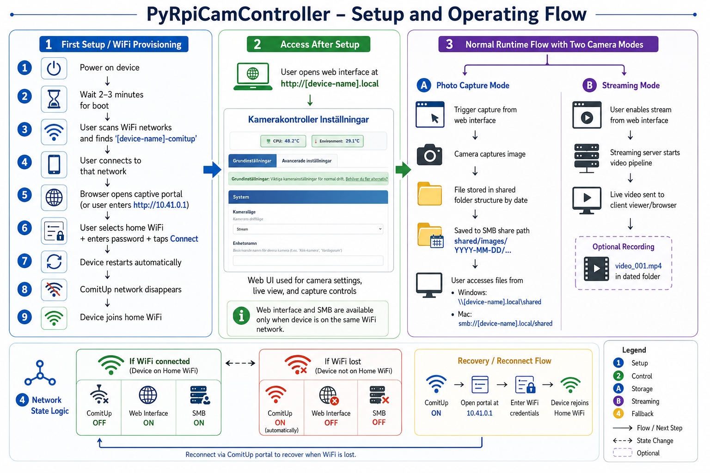

# PyRpiCamController User Guide

## 🎥 Welcome to your Raspberry Pi Camera Controller!

This guide explains how to set up and use your camera system.

## 🗺️ Setup & Operation Flow Diagram

Click the image to open full size:

<a href="_doc/Setup-and-operation-flow.png">
  
</a>

## 🚀 First Setup (WiFi Configuration)

When you first power on your camera device, it needs to connect to your WiFi network.

### Step 1: Find the WiFi Portal
1. **Power on** your camera device
2. **Wait 2-3 minutes** for the system to boot
3. On your phone/computer, **scan for WiFi networks**
4. Look for a network named **`comitup-<nnn>`** (where `<nnn>` is the unique number shown by Comitup)

### Step 2: Connect and Configure
1. **Connect** to the `comitup-<nnn>` network
2. Your device should automatically open a web page
   - If not, open a browser and go to: **`http://10.41.0.1`**
3. **Select your home WiFi** network from the list
4. **Enter your WiFi password**
5. Click **"Connect"**

### Step 3: System Restart
1. The device will **automatically restart**
2. The `comitup-<nnn>` network will **disappear**
3. Your camera will now be **connected to your home WiFi**

---

## 🌐 Daily Use (After WiFi Setup)

Once WiFi is configured, your camera system provides two ways to access files and settings:

### Camera Web Interface
- **URL**: `http://[device-name].local`
- **What it does**: Camera settings, live view, capture controls
- **When available**: Only when connected to your WiFi network

### File Sharing (SMB/Samba)
- **Windows**: Open File Explorer → `\\[device-name].local\shared`
- **Mac**: Finder → Go → Connect to Server → `smb://[device-name].local/shared`
- **What you'll find**: 
  - `images/` - All captured photos organized by date
  - `logs/` - System logs and installation records

> **Note**: `[device-name]` is your device's unique ID (usually starts with your Pi's serial number)

---

## 🔄 Network Behavior

Your camera system intelligently handles network connectivity:

### ✅ **When Connected to WiFi**
- ComitUp portal is **OFF**
- Camera web interface is **ON** (port 80)
- File sharing is **available**
- All camera functions work normally

### ❌ **When NO Network Available**
- ComitUp portal **starts automatically**
- Camera web interface is **OFF**
- File sharing is **unavailable** 
- Look for the `comitup-<nnn>` network to reconfigure WiFi

---

## 📁 File Organization

Your captured images are automatically organized by date:

```
shared/
├── images/
│   ├── 2026-04-18/          # Today's photos
│   │   ├── photo_001.jpg
│   │   └── video_001.mp4
│   ├── 2026-04-17/          # Yesterday's photos
│   └── ...
└── logs/
    ├── camera.log           # Camera system logs
    └── install_*.log        # Installation records
```

---

## 🔧 Troubleshooting

### Problem: Can't find `comitup-<nnn>` network
**Solution**: 
- Wait 5 minutes after power-on
- Check if device is already connected to WiFi
- If connected, access via `http://[device-name].local`

### Problem: Can't access camera web interface
**Solutions**:
1. **Check WiFi connection**: Device must be on same network as your computer
2. **Try device IP**: `http://[IP-address]` instead of `[device-name].local`
3. **Check network name**: Your device name is unique to your Pi

### Problem: File sharing not accessible
**Solutions**:
1. **Network connectivity**: Ensure both devices on same WiFi
2. **Wait after WiFi changes**: Give system 2-3 minutes after connecting
3. **Try IP address**: `\\[IP-address]\shared` instead of device name

### Problem: Need to change WiFi network
**Solutions**:
1. **Method 1**: Disconnect device from current WiFi (via router settings)
2. **Method 2**: Power off device, move to location without WiFi coverage
3. Wait for the `comitup-<nnn>` network to appear and reconfigure

---

## ⚡ Quick Reference

| Scenario | WiFi Portal | Web Interface | File Sharing |
|----------|-------------|---------------|--------------|
| **First boot** | ✅ Available | ❌ Not available | ❌ Not available |
| **WiFi connected** | ❌ Not available | ✅ Available | ✅ Available |
| **WiFi lost** | ✅ Auto-starts | ❌ Not available | ❌ Not available |

### Important URLs:
- **WiFi Setup**: `http://10.41.0.1` (when connected to `comitup-<nnn>`)
- **Camera Interface**: `http://[device-name].local` (when on WiFi)
- **File Access**: `\\[device-name].local\shared` (Windows) or `smb://[device-name].local/shared` (Mac)

---

## 🆘 Need Help?

If you're still having issues:
1. **Check power**: Ensure stable power supply 
2. **Wait patiently**: System needs 2-3 minutes to start properly
3. **Reboot**: Power off for 10 seconds, then power on
4. **Network range**: Ensure device is within WiFi range

Your camera system is designed to work automatically - most issues resolve themselves with a little patience! 🎯