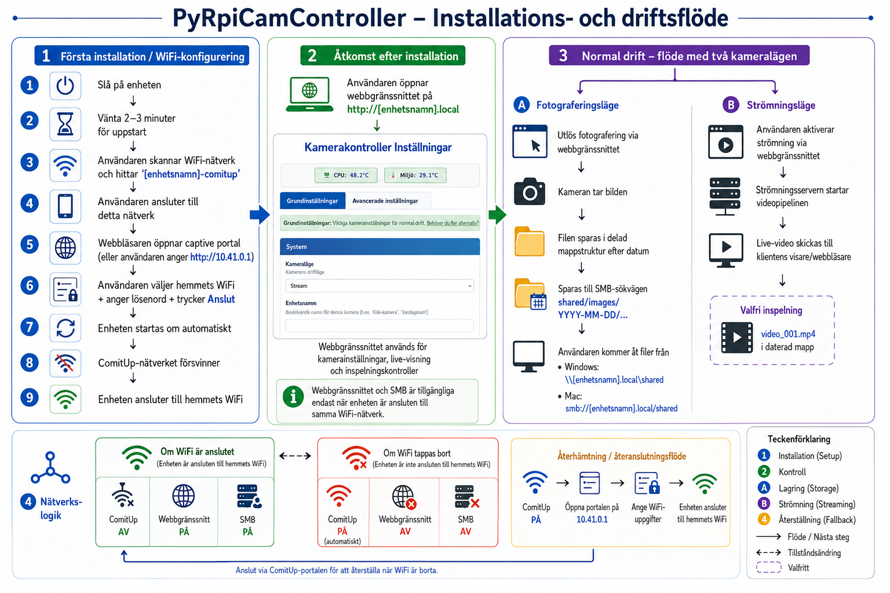

# PyRpiCamController Användarguide

## 🎥 Välkommen till din Raspberry Pi-kamerakontroller!

Den här guiden förklarar hur du installerar och använder ditt kamerasystem.
All kod och en massa övrig dokumentation finns på github: https://github.com/teddycool/PyRpiCamController/


## 🗺️ Flödesschema för installation och drift

Klicka på bilden för att öppna full storlek:

<a href="_doc/Setup-and-operation-flow-swe.png">
  
</a>

## 🚀 Första uppstart (WiFi-konfiguration)

När du startar kameran första gången behöver den ansluta till ditt WiFi-nätverk.

### Steg 1: Hitta WiFi-portalen
1. **Starta** din kameraenhet
2. **Vänta 2–3 minuter** medan systemet startar
3. På din telefon/dator, **sök efter WiFi-nätverk**
4. Leta efter ett nätverk som heter **`comitup-<nnn>`** (där `<nnn>` är det unika numret som visas av Comitup)

### Steg 2: Anslut och konfigurera
1. **Anslut** till nätverket `comitup-<nnn>`
2. En webbsida ska öppnas automatiskt
   - Om inte, öppna en webbläsare och gå till: **`http://10.41.0.1`**
3. **Välj ditt hemnätverk (WiFi)** i listan
4. **Ange ditt WiFi-lösenord**
5. Klicka på **"Connect"**

### Steg 3: Systemomstart
1. Enheten **startar om automatiskt**
2. Nätverket `comitup-<nnn>` **försvinner**
3. Din kamera är nu **ansluten till ditt hemnätverk**

---

## 🌐 Daglig användning (efter WiFi-setup)

När WiFi är konfigurerat finns två sätt att komma åt filer och inställningar:

### Kamerans webbgränssnitt
- **URL**: `http://[device-name].local`
- **Vad det gör**: kamerainställningar, livevy, bildtagning
- **När tillgängligt**: endast när enheten är ansluten till ditt WiFi

### Fildelning (SMB/Samba)
- **Windows**: Öppna Utforskaren → `\\[device-name].local\shared`
- **Mac**: Finder → Gå → Anslut till server → `smb://[device-name].local/shared`
- **Det här finns där**:
  - `images/` - Alla tagna bilder organiserade per datum
  - `logs/` - Systemloggar och installationsloggar

> **Obs**: `[device-name]` är enhetens unika ID (börjar oftast med Pi:ns serienummer)

---

## 🔄 Nätverksbeteende

Kamerasystemet hanterar nätverksanslutning automatiskt:

### ✅ **När WiFi är anslutet**
- ComitUp-portalen är **AV**
- Kamerans webbgränssnitt är **PÅ** (port 80)
- Fildelning är **tillgänglig**
- Alla kamerafunktioner fungerar normalt

### ❌ **När inget nätverk finns**
- ComitUp-portalen **startar automatiskt**
- Kamerans webbgränssnitt är **AV**
- Fildelning är **inte tillgänglig**
- Leta efter nätverket `comitup-<nnn>` för att konfigurera WiFi igen

---

## 📁 Filstruktur

Dina bilder organiseras automatiskt per datum:

```
shared/
├── images/
│   ├── 2026-04-18/          # Dagens bilder
│   │   ├── photo_001.jpg
│   │   └── video_001.mp4
│   ├── 2026-04-17/          # Gårdagens bilder
│   └── ...
└── logs/
    ├── camera.log           # Kamerasystemets loggar
    └── install_*.log        # Installationsloggar
```

---

## 🔧 Felsökning

### Problem: Hittar inte nätverket `comitup-<nnn>`
**Lösning**:
- Vänta 5 minuter efter uppstart
- Kontrollera om enheten redan är ansluten till WiFi
- Om den är ansluten, öppna `http://[device-name].local`

### Problem: Kan inte nå kamerans webbgränssnitt
**Lösningar**:
1. **Kontrollera WiFi**: enheten måste vara på samma nätverk som datorn
2. **Testa enhetens IP**: `http://[IP-address]` istället för `[device-name].local`
3. **Kontrollera enhetsnamn**: namnet är unikt för din Pi

### Problem: Fildelning går inte att nå
**Lösningar**:
1. **Nätverksanslutning**: säkerställ att båda enheterna är på samma WiFi
2. **Vänta efter WiFi-byte**: ge systemet 2–3 minuter efter anslutning
3. **Testa IP-adress**: `\\[IP-address]\shared` istället för enhetsnamn

### Problem: Behöver byta WiFi-nätverk
**Lösningar**:
1. **Metod 1**: koppla bort enheten från aktuellt WiFi (via routerinställningar)
2. **Metod 2**: stäng av enheten, flytta den till plats utan WiFi-täckning
3. Vänta tills `comitup-<nnn>` visas och konfigurera igen

---

## ⚡ Snabbreferens

| Scenario | WiFi-portal | Webbgränssnitt | Fildelning |
|----------|-------------|----------------|------------|
| **Första start** | ✅ Tillgänglig | ❌ Ej tillgänglig | ❌ Ej tillgänglig |
| **WiFi anslutet** | ❌ Ej tillgänglig | ✅ Tillgänglig | ✅ Tillgänglig |
| **WiFi förlorat** | ✅ Startar automatiskt | ❌ Ej tillgänglig | ❌ Ej tillgänglig |

### Viktiga URL:er:
- **WiFi-setup**: `http://10.41.0.1` (när du är ansluten till `comitup-<nnn>`)
- **Kameragränssnitt**: `http://[device-name].local` (när enheten är på WiFi)
- **Filåtkomst**: `\\[device-name].local\shared` (Windows) eller `smb://[device-name].local/shared` (Mac)

---

## 🆘 Behöver du hjälp?

Om du fortfarande har problem:
1. **Kontrollera strömförsörjning**: säkerställ stabil ström
2. **Vänta lite**: systemet behöver 2–3 minuter för att starta korrekt
3. **Starta om**: stäng av i 10 sekunder och starta igen
4. **Nätverksräckvidd**: kontrollera att enheten är inom WiFi-räckvidd

Kamerasystemet är byggt för att fungera automatiskt – de flesta problem löser sig med lite tålamod! 🎯
