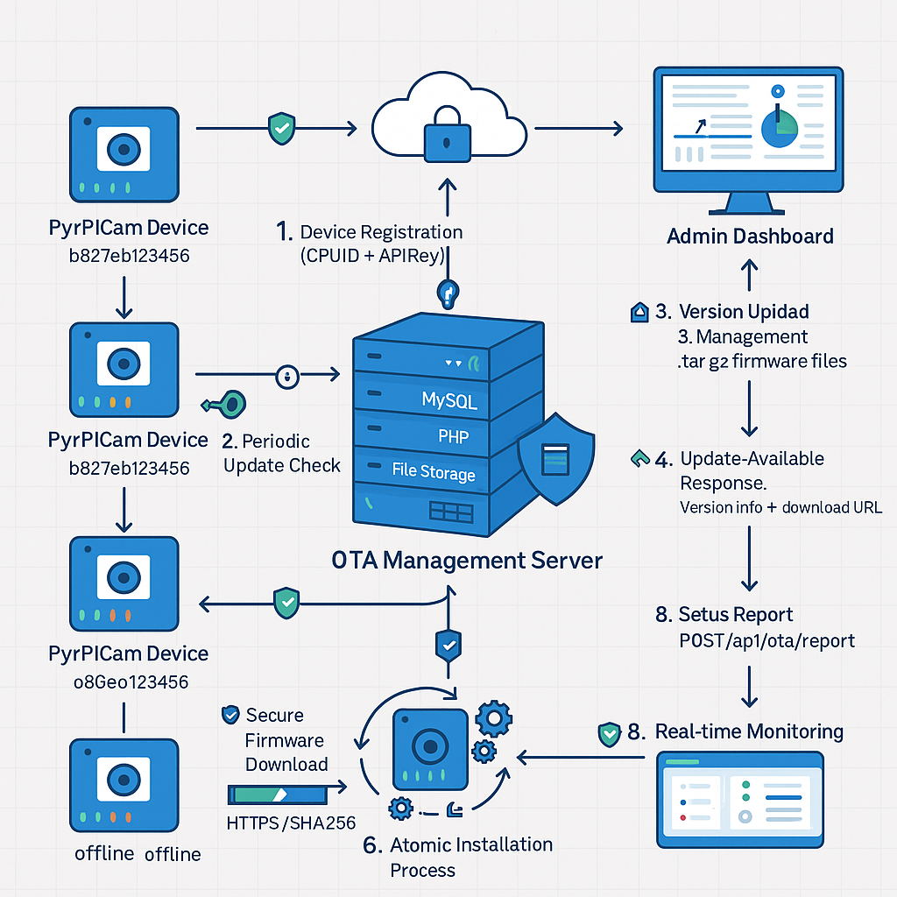

:toc:
:toc-title: Table of Contents
:toc-placement: preamble
= Over-The-Air (OTA) Update System Guide

The PyRpiCamController OTA system provides safe, automated updates for remote camera deployments. It includes comprehensive error handling, automatic rollback on failure, and manual recovery tools.

== Architecture

=== Core Components

----
ota/
├── install/
│   ├── installota_v2.py    # Main OTA manager (robust version)
│   ├── ota_daemon.py       # Background daemon for automatic checks
│   └── installota.py       # Original skeleton (deprecated)
├── camcontroller-update.service # Systemd service for OTA daemon
└── recovery.sh             # Emergency recovery script
----

=== Safety Features

✅ **Atomic Updates** - Complete rollback if anything fails +
✅ **Checksum Verification** - Ensures download integrity +
✅ **Health Checks** - Verifies service after update +
✅ **Automatic Rollback** - Restores previous version on failure +
✅ **Multiple Backups** - Keeps configurable number of backups +
✅ **Emergency Recovery** - Manual recovery tools when all else fails +

== Configuration

=== Settings Schema

The OTA system is configured through the unified settings system:

[source,json]
----
{
  "OtaEnable": false,                    // Master enable/disable
  "OTA": {
    "server_url": "https://example.com", // Update server URL
    "check_interval": 3600,              // Check interval in seconds
    "api_key": "your-api-key",           // Authentication for server
    "service_name": "camcontroller.service",     // Systemd service to manage
    "install_path": "/home/pi/PyRpiCamController",
    "backup_retention": 3,               // Number of backups to keep
    "health_check_timeout": 120,         // Health check timeout
    "download_timeout": 300              // Download timeout
  }
}
----

=== Web Interface Security

* **OtaEnable**: Not web-editable (security-sensitive)
* **server_url, api_key**: Not web-editable (security-sensitive)  
* **check_interval, backup_retention**: Web-editable (user preferences)
* **timeouts**: Web-editable (performance tuning)

== Installation

=== 1. Install Dependencies

----
pip install requests
----

=== 2. Setup OTA Daemon Service

----
# Copy service file
sudo cp Updates/camcontroller-update.service /etc/systemd/system/

# Reload systemd
sudo systemctl daemon-reload

# Enable service (start on boot)
sudo systemctl enable camcontroller-update.service

# Start service
sudo systemctl start camcontroller-update.service

# Check status
sudo systemctl status camcontroller-update.service
----

=== 3. Configure Settings

**Via Web Interface (Recommended):**

1. Open web interface: `http://your-camera-ip:5000`
2. Click "Advanced" tab
3. Configure OTA settings:
   - ✅ **OTA-uppdatering**: Enable/disable OTA updates
   - ⚙️ **OTA Server URL**: Your update server URL
   - 🔑 **OTA API-nyckel**: Your API key for authentication
   - ⏱️ **Update intervals and timeouts**: Timing configurations

**Via Code/Script:**

[source,python]
----
from Settings.settings_manager import settings_manager

# Enable OTA
settings_manager.set('OtaEnable', True)
settings_manager.set('OTA.server_url', 'https://your-server.com')
settings_manager.set('OTA.api_key', 'your-server-api-key')
settings_manager.set('OTA.check_interval', 3600)  # Check hourly
----

== Server-Side Requirements

Your update server needs these endpoints:

=== 1. Update Check Endpoint

----
GET /api/ota/check?cpu_id=SERIAL&current_version=1.0.0&api_key=KEY
----

Response when update available:

[source,json]
----
{
  "update_available": true,
  "version": "1.1.0",
  "download_url": "https://server.com/updates/pycam_v1.1.0.tar.gz",
  "checksum": "sha256:abcd1234...",
  "requires_reboot": false,
  "release_notes": "Bug fixes and improvements"
}
----

Response when no update:

[source,json]
----
{
  "update_available": false,
  "current_version": "1.0.0"
}
----

=== 2. Status Report Endpoint

----
POST /api/ota/report
Content-Type: application/json

{
  "cpu_id": "device-serial",
  "status": "success|failed|started",
  "version": "1.1.0",
  "timestamp": "2023-11-14T12:00:00",
  "api_key": "your-key",
  "error_message": "optional error details"
}
----

=== 3. Update Package Format

Update packages should be `.tar.gz` files containing:

----
PyRpiCamController/
├── CamController/
├── Settings/
│   ├── settings_manager.py
│   ├── settings_schema.json
│   └── user_settings.json
├── WebGui/
│   └── web_app.py
├── VERSION              # Text file with version number
└── ... (all other files)
----

== Operation

=== Automatic Operation

1. **OTA Daemon** runs as systemd service
2. **Periodic Checks** every `check_interval` seconds
3. **Downloads** update if available
4. **Verifies** checksum
5. **Creates Backup** of current installation
6. **Stops Service**, installs update, starts service
7. **Health Check** - verifies service is working
8. **Rollback** if health check fails
9. **Reports Status** to server

=== Manual Operation

==== Manual Update Check

----
# Check for updates once
python3 ota/install/ota_daemon.py --manual

# Or use the OTA manager directly
python3 ota/install/installota_v2.py
----

==== Manual Recovery

----
# List available backups
./ota/recovery.sh list

# Restore latest backup
./ota/recovery.sh restore-latest

# Restore specific backup
./ota/recovery.sh restore /home/pi/ota/backups/backup_1.0.0_20231114.tar.gz

# Check system health
./ota/recovery.sh health

# Emergency cleanup
./ota/recovery.sh cleanup

# Reset OTA system (disable and clean)
./ota/recovery.sh reset-ota
----

== Update Process Flow

The following diagram illustrates the complete Over-The-Air update workflow:

=== Process Overview

The OTA system follows a comprehensive workflow designed for reliability and security:

==== 1. Device Registration & Initialization
* **Device Startup**: PyRpiCamController devices boot and initialize their OTA client
* **Registration**: Devices register with the server using their CPU ID (from hardware serial)
* **Authentication**: Server generates and assigns API keys for secure communication
* **Group Assignment**: Devices are assigned to update groups (stable, testing, development)

==== 2. Periodic Update Checks
* **Scheduled Checks**: OTA daemon periodically queries the server for available updates
* **Version Comparison**: Server compares device's current version (from VERSION file) with available releases
* **Group Filtering**: Only versions approved for the device's update group are considered
* **Response**: Server responds with update availability and download information

==== 3. Update Download & Verification
* **Secure Download**: If update available, device downloads package from provided URL
* **Integrity Check**: Downloaded package is verified using SHA-256 checksums
* **Size Validation**: File size is verified against expected values
* **Backup Creation**: Current system state is backed up before update

==== 4. Installation Process
* **Service Stop**: Camera services are gracefully stopped (camcontroller.service)
* **File Extraction**: Update package is extracted to temporary location
* **System Update**: Files are copied to appropriate system locations
* **Configuration Migration**: Settings are preserved and migrated if needed
* **Service Restart**: Camera services are restarted with new version

==== 5. Status Reporting & Monitoring
* **Success Reporting**: Device reports successful update completion to server
* **Error Handling**: Failed updates are reported with detailed error information
* **Rollback Support**: Critical failures trigger automatic rollback to previous version
* **Logging**: All activities are logged locally and remotely for monitoring

==== 6. Admin Monitoring & Management
* **Dashboard Monitoring**: Administrators track update progress across all devices
* **Version Management**: New versions can be uploaded and promoted through testing stages
* **Device Control**: Individual devices can be forced to update or excluded from updates
* **Analytics**: Update success rates and device health metrics are tracked

=== Detailed Flow Diagram

----
1. Check for Updates
   ├── OTA Disabled → Skip
   ├── No Updates Available → Wait for next interval
   └── Update Available → Continue

2. Download Update
   ├── Download Failed → Log error, retry next interval
   ├── Checksum Failed → Log error, report to server
   └── Success → Continue

3. Create Backup
   ├── Backup Failed → Abort update
   └── Success → Continue

4. Install Update
   ├── Stop camcontroller.service
   ├── Extract package to temp location
   ├── Replace files in installation directory
   ├── Set proper permissions
   └── Start camcontroller.service

5. Verify Installation
   ├── Health Check Failed → Automatic rollback
   └── Success → Complete update

6. Rollback (if needed)
   ├── Stop camcontroller.service
   ├── Restore from backup
   ├── Start camcontroller.service
   └── Report failure to server

7. Status Reporting
   ├── Success → Report completion to server
   ├── Failure → Report error details to server
   └── Update local logs
----

=== Key Features

* **Gradual Rollouts**: Updates can be tested on development/testing groups before stable release
* **Atomic Updates**: Updates either complete successfully or rollback completely
* **Network Resilience**: Failed downloads are automatically retried with exponential backoff
* **Bandwidth Optimization**: Updates use compression and delta patching when possible
* **Security**: All communications are authenticated and can be encrypted with HTTPS
* **Monitoring**: Comprehensive logging and real-time status tracking
* **Zero-Downtime Rollbacks**: Quick restoration from verified backups

== Error Handling & Recovery

=== Automatic Recovery

The system handles these failure scenarios automatically:

1. **Download Failures** - Retry on next check interval
2. **Checksum Mismatches** - Reject update, report error
3. **Installation Failures** - Automatic rollback to previous version
4. **Service Health Failures** - Automatic rollback
5. **Rollback Failures** - Report critical error for manual intervention

=== Manual Recovery

When automatic recovery fails:

1. **Check Logs**:
+
----
# OTA daemon logs
journalctl -u camcontroller-update.service -f

# OTA installation logs
tail -f /home/pi/shared/logs/ota.log
----

2. **System Health Check**:
+
----
./ota/recovery.sh health
----

3. **Emergency Rollback**:
+
----
./ota/recovery.sh restore-latest
----

4. **Nuclear Option** (last resort):
+
----
# Disable OTA and clean everything
./ota/recovery.sh reset-ota

# Manually install known-good version
# Then re-enable OTA when ready
----

== Monitoring & Logging

=== Log Locations

* **OTA Daemon**: `journalctl -u camcontroller-update.service`
* **OTA Operations**: `/home/pi/shared/logs/ota.log`
* **Recovery Operations**: `/home/pi/shared/logs/recovery.log`

=== Status Monitoring

----
# Check OTA daemon status
systemctl status camcontroller-update.service

# Check when last update was attempted
grep "Checking for updates" /home/pi/shared/logs/ota.log | tail -5

# Check for recent errors
grep "ERROR" /home/pi/shared/logs/ota.log | tail -10
----

=== Server-Side Monitoring

Monitor your update server for:

* Failed update reports
* Devices not checking in
* High rollback rates
* Download failures

== Security Considerations

1. **API Keys** - Use strong, unique API keys for each deployment
2. **HTTPS** - Always use HTTPS for update server
3. **Checksums** - Verify all downloads with SHA256
4. **Permissions** - OTA runs as `pi` user, not root
5. **Validation** - Server should validate device identity
6. **Staging** - Test updates in staging environment first

== Troubleshooting

=== Common Issues

==== OTA Daemon Not Starting

----
# Check service status
systemctl status camcontroller-update.service

# Check for permission issues
sudo journalctl -u camcontroller-update.service -n 50
----

==== Updates Not Being Applied

----
# Check if OTA is enabled
grep -i "ota" /home/pi/PyRpiCamController/Settings/user_settings.json

# Check network connectivity
curl -I https://your-update-server.com

# Force manual check
python3 ota/install/ota_daemon.py --manual
----

==== Service Won't Start After Update

----
# Check service status
systemctl status camcontroller.service

# Check recent logs
journalctl -u camcontroller.service -n 50

# Emergency rollback
./ota/recovery.sh restore-latest
----

== Best Practices

1. **Test Updates** - Always test in development environment first
2. **Gradual Rollout** - Deploy to subset of devices first
3. **Monitor Closely** - Watch logs during rollout
4. **Backup Strategy** - Keep multiple backup versions
5. **Rollback Plan** - Have rollback procedure ready
6. **Version Control** - Tag all released versions
7. **Change Log** - Maintain detailed release notes

== Development Workflow

=== Preparing Updates

1. **Version Tagging**:
+
----
echo "1.1.0" > VERSION
git tag v1.1.0
----

2. **Package Creation**:
+
----
tar -czf pycam_v1.1.0.tar.gz PyRpiCamController/
----

3. **Checksum Generation**:
+
----
sha256sum pycam_v1.1.0.tar.gz > pycam_v1.1.0.checksum
----

4. **Upload to Server** and update server database

=== Testing Updates

1. **Test Environment** - Deploy to test Pi first
2. **Enable OTA** - Set short check interval for testing
3. **Monitor Logs** - Watch update process closely
4. **Verify Rollback** - Test rollback scenarios

This comprehensive OTA system provides enterprise-grade update capabilities for your camera controller with robust error handling and recovery mechanisms.