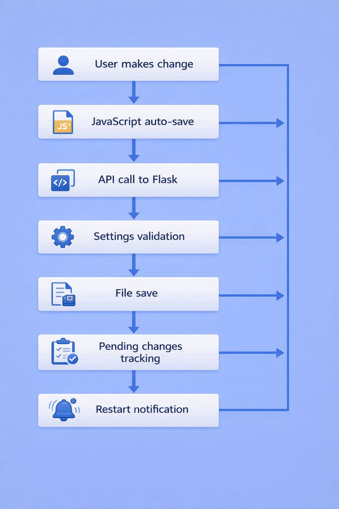
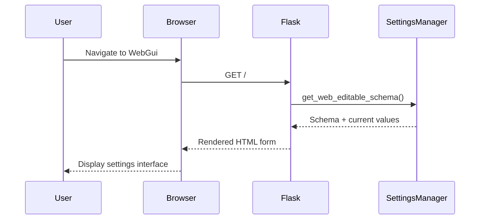

# PyRpiCamController WebGui Documentation

This document explains how the WebGui system works, including API endpoints, user flows, and the architecture of the camera controller's web interface.

## Overview

The WebGui is a Flask-based web application that provides a user-friendly interface for configuring and controlling the PyRpiCamController. It allows users to modify camera settings, switch between modes, monitor streaming status, and restart services when needed.

## Architecture

### Core Components

- **Flask Application** (`web_app.py`): Main web server with REST API endpoints
- **HTML Template** (`templates/settings_form.html`): Dynamic web interface with JavaScript
- **Settings Manager Integration**: Direct connection to the unified settings system
- **Persistent Change Tracking**: File-based system for tracking pending changes

### Key Features

- **Auto-save functionality**: Settings are automatically saved as you type/select
- **Real-time validation**: Immediate feedback on setting changes
- **Restart notifications**: Tracks which settings require service restart
- **Streaming integration**: Direct links and status monitoring for camera streams
- **Basic/Advanced modes**: Two-tier interface for different user levels

## API Endpoints

### 1. Main Interface
```http
GET /
```
**Purpose**: Serves the main settings form
**Parameters**: 
- `level` (optional): `basic` or `advanced` (default: `basic`)
**Response**: HTML page with settings form

---

### 2. Settings Management

#### Update Settings (Primary)
```http
POST /api/settings
Content-Type: application/json
```
**Purpose**: Update one or multiple settings
**Request Body Examples**:
```json
// Single setting update
{"Cam.resolution": "[1920, 1080]"}

// Multiple settings update
{
  "Mode": "Stream",
  "LogLevel": "debug",
  "Light": 75
}

// Alternative format
{
  "field": "Mode",
  "value": "Cam"
}
```
**Response**:
```json
{
  "success": true,
  "message": "Updated 1 setting(s)",
  "updated_fields": [
    {
      "field": "Cam.resolution",
      "value": [1920, 1080]
    }
  ],
  "pending_changes": {
    "changes": {
      "Cam.resolution": [1920, 1080]
    },
    "count": 1
  }
}
```

#### Update Single Setting (Alternative)
```http
POST /api/settings/update
Content-Type: application/json
```
**Purpose**: Update a single setting (alternative endpoint)
**Request Body**:
```json
{
  "field": "Mode",
  "value": "Stream"
}
```

---

### 3. Change Tracking

#### Get Pending Changes
```http
GET /api/settings/pending
```
**Purpose**: Get list of settings that have changed and require restart
**Response**:
```json
{
  "changes": {
    "Cam.resolution": [1920, 1080],
    "Stream.port": 8080
  },
  "count": 2
}
```

#### Apply Changes and Restart Service
```http
POST /api/service/apply-and-restart
```
**Purpose**: Apply all pending changes by restarting the camera service
**Response**:
```json
{
  "success": true,
  "message": "Service restart initiated",
  "restart_file": "/tmp/restart_camcontroller"
}
```

---

### 4. Streaming Control

#### Get Stream Status
```http
GET /api/stream/status
```
**Purpose**: Check if streaming server is running and get stream info
**Response**:
```json
{
  "running": true,
  "url": "http://raspberrypi.local:8080",
  "port": 8080,
  "resolution": [1024, 768],
  "framerate": 30,
  "title": "Live Camera Stream"
}
```

#### Stream Redirect
```http
GET /stream
```
**Purpose**: Redirect to the actual streaming server
**Response**: HTTP 302 redirect to streaming server

---

### 5. Debug and Testing

#### Debug Information
```http
GET /api/settings/debug
```
**Purpose**: Get comprehensive debug information about settings
**Response**: Detailed JSON with all settings, schema, and system state

#### Health Check
```http
GET /api/test
```
**Purpose**: Simple health check endpoint
**Response**:
```json
{
  "status": "OK",
  "message": "Flask server is responding",
  "current_mode": "Cam"
}
```

## User Flow: Changing a Setting

### Interface Screenshots and Diagrams

**Image 1: WebGui Settings Interface**

*Main settings interface showing sections, form controls, and basic/advanced tabs*

**Image 2: Setting Change Flow Diagram**

*Technical flow diagram showing the complete process from user input to service restart*

**Image 3: Restart Notification Panel**

*Notification system showing pending changes and restart button*

### Step-by-Step Flow

#### 1. User Interface Load


**What happens:**
- User opens the WebGui in their browser
- Flask loads the current settings schema and values
- Settings are organized by section (Camera, Stream, System, etc.)
- Form is rendered with current values pre-filled
- JavaScript sets up auto-save listeners on all form elements

#### 2. Setting Change Detection
```javascript
// Auto-save setup (from settings_form.html)
function setupAutoSave() {
    const inputs = document.querySelectorAll('input:not([readonly]), select:not([disabled])');
    inputs.forEach(input => {
        input.addEventListener('change', function() {
            autoSave(this);
        });
    });
}
```

**What happens:**
- JavaScript monitors all form elements for changes
- When user changes any setting (dropdown, input, checkbox), the `change` event fires
- The `autoSave()` function is called immediately

#### 3. Value Processing and API Call
```javascript
function autoSave(field) {
    const value = getInputValue(field);
    
    fetch('/api/settings', {
        method: 'POST',
        headers: { 'Content-Type': 'application/json' },
        body: JSON.stringify({
            [field.name]: value
        })
    })
    .then(response => {
        if (response.ok) {
            // Visual feedback - flash green
            field.style.backgroundColor = '#d4edda';
            setTimeout(() => {
                field.style.backgroundColor = '';
            }, 1000);
            
            // Update pending changes display
            updatePendingChanges();
        } else {
            console.error('Auto-save failed for', field.name);
        }
    })
}
```

**What happens:**
- `getInputValue()` extracts the value based on field type (checkbox, select, text, etc.)
- For enum fields like resolution, JSON strings like `"[1920, 1080]"` are sent
- POST request sent to `/api/settings` endpoint
- Success: Green flash animation, pending changes updated
- Failure: Error logged to console

#### 4. Backend Processing
```python
@app.route("/api/settings", methods=["POST"])
def update_settings():
    data = request.get_json()
    
    for field, value in data.items():
        schema_info = ui_schema[field]
        
        # Convert value based on schema type
        converted_value = convert_form_value(value, schema_info)
        
        # Save to settings manager
        settings_manager.set(field, converted_value, save=True)
        
        # Track for restart notification
        track_setting_change(field, converted_value)
```

**What happens:**
- Flask receives the JSON data
- `convert_form_value()` processes the value based on schema type:
  - `enum`: JSON strings like `"[1920, 1080]"` parsed to arrays `[1920, 1080]`
  - `bool`: String "true"/"false" converted to boolean
  - `int`/`float`: String numbers converted to numeric types
- Settings Manager validates against schema (type, min/max, enum options)
- Value saved to settings files
- Change tracked in persistent file `/tmp/webgui_pending_changes.json`

#### 5. Pending Changes Tracking
```python
def track_setting_change(field, value):
    """Track a setting change for restart notification"""
    pending_changes = load_pending_changes()
    pending_changes[field] = value
    save_pending_changes_to_file(pending_changes)
```

**What happens:**
- Each setting change is recorded in a persistent JSON file
- This survives web server restarts (unlike memory-based tracking)
- File location: `/tmp/webgui_pending_changes.json`
- Format: `{"Cam.resolution": [1920, 1080], "Stream.port": 8080}`

#### 6. UI Updates
```javascript
async function updatePendingChanges() {
    const response = await fetch('/api/settings/pending');
    const data = await response.json();
    const changes = Object.keys(data.changes);
    
    if (changes.length > 0) {
        // Show restart notification
        statusLight.className = 'status-light stopped';
        statusText.textContent = `${changes.length} setting(s) changed - restart needed to apply`;
        
        // Enable restart button
        applyButton.disabled = false;
    } else {
        // Hide notification
        statusLight.className = 'status-light running';
        statusText.textContent = 'All settings are active - no restart needed';
        applyButton.disabled = true;
    }
}
```

**What happens:**
- Frontend polls `/api/settings/pending` every 10 seconds
- UI updates to show orange notification if changes pending
- Restart button becomes enabled
- User sees exactly how many settings have changed

#### 7. Applying Changes (Restart)
When user clicks "Apply Changes & Restart Service":

```python
@app.route("/api/service/apply-and-restart", methods=["POST"])
def apply_and_restart():
    restart_file_path = "/tmp/restart_camcontroller"
    
    with open(restart_file_path, 'w') as f:
        f.write(f"restart requested at {time.time()}")
    
    # Clear pending changes only after restart file created
    clear_pending_changes()
```

**What happens:**
- Creates `/tmp/restart_camcontroller` file
- External process (systemd, supervisor, or monitoring script) detects this file
- Camera controller service restarts and loads new settings
- Pending changes cleared from tracking
- UI updates to show "restart in progress" state

## Data Types and Validation

### Supported Setting Types

| Type | Frontend | Backend Processing | Example |
|------|----------|-------------------|---------|
| `string` | Text input | Direct string | `"Camera 1"` |
| `int` | Number input | Parse to integer | `15` |
| `float` | Number input | Parse to float | `0.5` |
| `bool` | Checkbox | String to boolean | `true`/`false` |
| `enum` | Select dropdown | JSON parse for arrays | `["1920", "1080"]` |
| `tuple` | Text input | Comma-split + parse | `[6, 19]` |
| `password` | Password input | String (masked) | `"secret123"` |

### Special Handling: Resolution Enums

Resolution settings use arrays as enum values, requiring special processing:

**Frontend (HTML)**:
```html
<select name="Cam.resolution">
  <option value='[4608, 2592]'>4608 × 2592</option>
  <option value='[1920, 1080]' selected>1920 × 1080</option>
  <option value='[1280, 720]'>1280 × 720</option>
</select>
```

**Backend Processing**:
```python
def convert_form_value(raw_value, schema_info):
    if schema_info.get('type') == 'enum':
        # Handle JSON array strings for resolution enums
        if isinstance(raw_value, str) and raw_value.startswith('['):
            try:
                value = json_module.loads(raw_value)  # "[1920, 1080]" -> [1920, 1080]
            except json_module.JSONDecodeError:
                value = raw_value
        else:
            value = raw_value
    return value
```

## Error Handling

### Frontend Error Handling
- **Network errors**: Shown in console, field remains unchanged
- **Validation errors**: Displayed as error messages below form fields
- **Connection loss**: Automatic retry mechanism

### Backend Error Handling
- **Schema validation**: Type checking, min/max values, enum options
- **File system errors**: Graceful fallback for settings persistence
- **JSON parsing errors**: Fallback to original string value

### Common Error Scenarios
1. **Invalid enum value**: Backend rejects, frontend shows error
2. **Out of range number**: Validation catches, shows min/max message
3. **Network timeout**: Frontend retries, shows connection status
4. **Settings file corruption**: Falls back to schema defaults

## Security Considerations

- **Input validation**: All values validated against schema
- **No direct file system access**: Settings Manager handles all file operations
- **Read-only settings**: Some settings marked as non-editable via web interface
- **Local network only**: Flask server binds to all interfaces but intended for local use

## Troubleshooting

### Common Issues

1. **Settings not saving**: Check browser console for JavaScript errors
2. **Restart notifications not appearing**: Check `/tmp/webgui_pending_changes.json` exists
3. **Enum dropdowns showing raw arrays**: Indicates frontend template issue
4. **500 errors on setting change**: Usually indicates backend validation failure

### Debug Tools

- **Debug endpoint**: `GET /api/settings/debug` for comprehensive state dump
- **Browser console**: Shows all AJAX requests and responses
- **Flask debug mode**: Detailed error messages and stack traces
- **Settings Manager logging**: Validation errors and file operations

## Integration Points

### External Components
- **Settings Manager**: Core settings persistence and validation
- **Camera Controller Service**: Reads settings changes on restart
- **Streaming Server**: Controlled via Mode setting
- **System Services**: Restart mechanism via file-based signaling

### File System Integration
- **Settings files**: JSON files managed by Settings Manager
- **Restart signaling**: `/tmp/restart_camcontroller` file
- **Pending changes**: `/tmp/webgui_pending_changes.json` file
- **Log files**: Flask and application logs for debugging

---

*This documentation covers the complete WebGui system. For specific implementation details, refer to the source code in `web_app.py` and `settings_form.html`.*