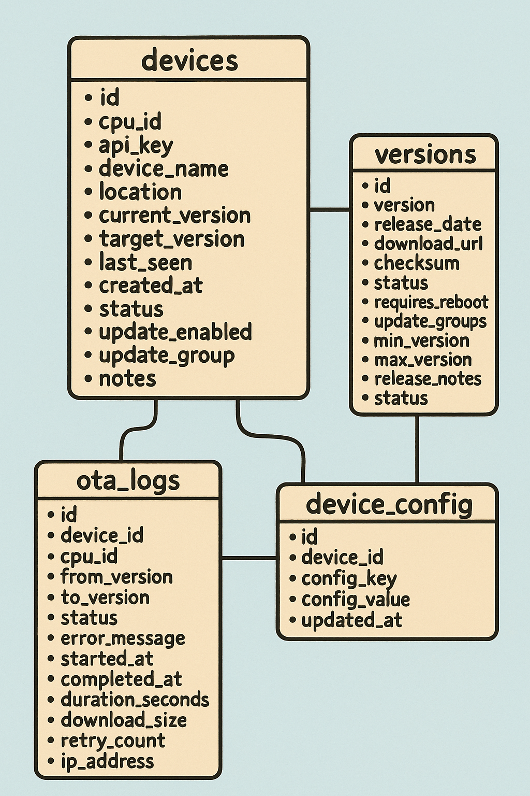

# PyRpiCamController Backend Systems

**Table of Contents**
- [Deployment Structure](#deployment-structure)
- [Components](#components)
- [Installation Guide](#installation-guide)
- [API Endpoints](#api-endpoints)
- [Security Features](#security-features)
- [Device Integration](#device-integration)
- [Monitoring](#monitoring)
- [Troubleshooting](#troubleshooting)
- [Performance Features](#performance-features)
- [Integration with Client](#integration-with-client)

This backend provides server-side infrastructure for the PyRpiCamController project, including Over-The-Air (OTA) updates and image publishing systems. The backend is now organized into separate subsystems for better maintainability.

**Note:** This documentation refers to the legacy monolithic backend structure. The current backend is now organized into separate Updates and ImagePublisher systems. See the respective README.md files in backend/Updates/ and backend/ImagePublisher/ directories.

## Deployment Structure

The backend is configured for deployment in a subfolder to coexist with other web applications:

- **Main site**: `https://your-domain.com/` (e.g., WordPress or other CMS)
- **OTA system**: `https://your-domain.com/pycamota/` (This backend)

## Components

### Database Schema
- **backend/Updates/database/ota_schema.sql**: Complete MySQL database schema for OTA updates
- **backend/ImagePublisher/database/logging_schema.sql**: Database schema for image and log data
- Includes stored procedures for secure operations and sample data



### Core PHP Files
- **backend/Updates/utils/config.php**: Central configuration for OTA system
- **backend/Updates/api/ota_check.php**: Device update check endpoint
- **backend/Updates/api/ota_report.php**: Status reporting endpoint
- **backend/ImagePublisher/api/receive_and_store_image_data.php**: Image upload handling
- **backend/ImagePublisher/api/post_logitem.php**: Log data reception

### Management APIs
- **device_management.php**: REST API for device CRUD operations, filtering, and force updates
- **version_management.php**: REST API for version management, file uploads, and promotion workflows

### Admin Interface
- **admin_dashboard.php**: Web-based dashboard for managing devices and versions
- **admin_login.php**: Administrative login interface
- **admin_logout.php**: Session cleanup
- **admin_auth.php**: Authentication handling

### Additional Files
- **api_test.php**: API testing and debugging endpoint
- **simple_device_list.php**: Simple device listing for debugging
- **db_setup.php**: Database initialization and sample data
- **db_status.php**: Database health checking

## Installation Guide

### Prerequisites
- Apache web server with mod_rewrite enabled
- PHP 7.4 or higher with extensions: mysqli, json, fileinfo
- MySQL 5.7 or MariaDB 10.2 or higher
- SSL certificate (recommended for production)

### Quick Start
1. **Download**: Clone or download the PyRpiCamController repository
2. **Extract**: Copy the `/backend/` folder to your web server
3. **Database**: Create MySQL database and user
4. **Configure**: Edit `config.php` with your settings
5. **Initialize**: Run `db_setup.php` to create tables
6. **Test**: Access `/pycamota/admin/` to verify installation

### 1. Database Setup
```sql
-- Create database
CREATE DATABASE pyrpicam_ota CHARACTER SET utf8mb4 COLLATE utf8mb4_unicode_ci;

-- Create user
CREATE USER 'ota_user'@'localhost' IDENTIFIED BY 'your_secure_password_here';
GRANT ALL PRIVILEGES ON pyrpicam_ota.* TO 'ota_user'@'localhost';
FLUSH PRIVILEGES;

-- Import schema
mysql -u ota_user -p pyrpicam_ota < ota_database_schema.sql
```

### 2. PHP Configuration
Edit `config.php` to match your environment:

```php
// Database settings
define('DB_HOST', 'localhost');
define('DB_NAME', 'pyrpicam_ota');
define('DB_USER', 'ota_user');
define('DB_PASS', 'your_secure_password_here');

// File storage
define('STORAGE_DIR', '/var/www/html/pycamota/storage');
define('UPDATES_BASE_URL', 'https://your-domain.com/pycamota/releases/');

// Security
define('REQUIRE_HTTPS', true);
```

Copy `secrets_tmpl.php` to `secrets.php` and configure:
```php
// Admin authentication
define('ADMIN_USERNAME', 'your_admin_username');
define('ADMIN_PASSWORD', 'your_secure_admin_password');

// API security
define('API_SECRET_KEY', 'your_api_secret_key');
```

### 3. Directory Structure
Create required directories:
```bash
mkdir -p /var/www/html/pycamota/storage/versions
mkdir -p /var/log/pycamota
chown -R www-data:www-data /var/www/html/pycamota/storage
chown -R www-data:www-data /var/log/pycamota
```

### 4. Web Server Configuration

#### Apache (.htaccess)
The included .htaccess file provides comprehensive configuration for Apache servers:

**Key features:**
- **Security**: Blocks direct access to configuration files and logs
- **API routing**: Clean URLs for all API endpoints
- **Admin interface**: Protected admin dashboard routing
- **Performance**: Gzip compression and optimized headers
- **CORS support**: Cross-origin resource sharing for API access
- **File restrictions**: Blocks access to sensitive file types

```apache
# PyRpiCamController OTA API .htaccess
# Designed to coexist with WordPress in parent directory
# Place this file in /public_html/pycamota/

<IfModule mod_rewrite.c>
    RewriteEngine On
    RewriteBase /pycamota/
    
    # Security: Block direct access to sensitive files
    RewriteRule ^secrets\.php$ - [F,L]
    RewriteRule ^config\.php$ - [F,L]
    RewriteRule ^logs/.*$ - [F,L]
    RewriteRule ^storage/.*$ - [F,L]
    RewriteRule ^\..*$ - [F,L]
    
    # OTA API endpoints
    RewriteRule ^api/ota/check/?$ ota_check.php [L]
    RewriteRule ^api/ota/report/?$ ota_report.php [L]
    
    # Version management API
    RewriteRule ^api/versions/?$ version_management.php [L]
    RewriteRule ^api/versions/([0-9]+)/?$ version_management.php?id=$1 [L]
    
    # Device management API
    RewriteRule ^api/devices/?$ device_management.php [L]
    RewriteRule ^api/devices/([a-zA-Z0-9]+)/?$ device_management.php?cpu_id=$1 [L]
    
    # Logs API
    RewriteRule ^api/logs/?$ ota_report.php?action=logs [L]
    
    # Admin dashboard and authentication
    RewriteRule ^admin/login/?$ admin_login.php [L]
    RewriteRule ^admin/logout/?$ admin_logout.php [L]
    RewriteRule ^admin/?$ admin_dashboard.php [L]
    
    # Debug endpoints
    RewriteRule ^api/test/?$ api_test.php [L]
    RewriteRule ^api/simplelist/?$ simple_device_list.php [L]
</IfModule>

# Security headers for OTA API
<IfModule mod_headers.c>
    Header always set X-Content-Type-Options nosniff
    Header always set X-Frame-Options DENY
    Header always set X-XSS-Protection "1; mode=block"
    Header always set Referrer-Policy strict-origin-when-cross-origin
    
    # CORS headers for API endpoints
    <FilesMatch "\.(php)$">
        Header always set Access-Control-Allow-Origin "*"
        Header always set Access-Control-Allow-Methods "GET, POST, PUT, DELETE, OPTIONS"
        Header always set Access-Control-Allow-Headers "Content-Type, Authorization, X-Requested-With, API-Key"
    </FilesMatch>
</IfModule>

# File type restrictions
<Files "*.log">
    Order allow,deny
    Deny from all
</Files>

<Files "*.sql">
    Order allow,deny
    Deny from all
</Files>

# PHP security settings
<IfModule mod_php7.c>
    php_flag expose_php off
    php_value upload_max_filesize 100M
    php_value post_max_size 100M
    php_value max_execution_time 300
</IfModule>
```

## API Endpoints

### Device Management
```
GET    /api/devices           - List all devices
POST   /api/devices           - Register new device
GET    /api/devices/{cpu_id}  - Get device details
PUT    /api/devices/{cpu_id}  - Update device
DELETE /api/devices/{cpu_id}  - Delete device
GET    /api/devices/{cpu_id}/logs - Get device logs
POST   /api/devices/{cpu_id}/force-update - Force update
```

### Version Management
```
GET    /api/versions          - List all versions
POST   /api/versions          - Upload new version
GET    /api/versions/{id}     - Get version details
PUT    /api/versions/{id}     - Update version metadata
DELETE /api/versions/{id}     - Delete version
POST   /api/versions/{id}/promote - Promote to stable
POST   /api/versions/{id}/rollback - Rollback to testing
```

### OTA Operations
```
POST   /api/ota/check         - Check for updates (device endpoint)
POST   /api/ota/report        - Report status (device endpoint)
```

### Admin Operations
```
GET    /admin                 - Admin dashboard
POST   /admin/login           - Administrative login
POST   /admin/logout          - Administrative logout
```

### Debug Operations
```
GET    /api/test              - API testing endpoint
GET    /api/simplelist        - Simple device list (debugging)
GET    /api/logs              - System logs access
```

## Security Features

### Authentication
- **Device authentication**: Via CPU ID and API key
- **Admin authentication**: Web-based login system for administrative access
- **Rate limiting**: 100 requests/hour per IP for API endpoints
- **Request size limits**: 1MB maximum request size

### Access Control
- **File protection**: Direct access blocked to sensitive files (.php configs, logs, etc.)
- **Directory protection**: Storage and logs directories secured
- **Admin interface**: Protected behind authentication system

### Data Validation
- Input sanitization and validation
- SQL injection prevention
- File upload restrictions

### Logging
- Comprehensive activity logging
- Error tracking and debugging
- Audit trail for all operations

## Device Integration

Your PyRpiCamController devices should:

1. **Check for updates** by posting to `/api/ota/check` with:

```json
{
    "cpu_id": "device_cpu_id",
    "api_key": "device_api_key",
    "current_version": "1.0.0",
    "update_group": "stable"
}
```

2. **Report status** by posting to `/api/ota/report` with:

```json
{
    "cpu_id": "device_cpu_id",
    "api_key": "device_api_key",
    "status": "completed",
    "from_version": "1.0.0",
    "to_version": "1.1.0"
}
```

## Monitoring

### Database Views
- `device_overview`: Complete device information with latest stats
- `update_summary`: Summary of update activities

### Stored Procedures
- `GetDeviceUpdate(cpu_id)`: Secure update checking
- `LogOTAStatus(...)`: Status logging with validation

### Admin Dashboard
Access the web dashboard at your domain's `/pycamota/admin/` path to:

- View device status and statistics
- Manage versions and deployments
- Monitor update progress and logs
- Configure device settings

The dashboard provides comprehensive monitoring and management capabilities for your OTA deployment.

## Troubleshooting

### Common Issues
1. **Database connection failed**: Check credentials and host
2. **File upload errors**: Verify directory permissions
3. **API authentication failed**: Check device API keys
4. **Version not found**: Ensure version is promoted to stable

### Debugging
Enable debug logging in `config.php`:
```php
define('LOG_LEVEL', 'DEBUG');
```

Check logs in `/var/log/pycamota/ota_api.log`

## Performance Features

### Compression
- **Gzip compression**: Automatic compression for HTML, CSS, JavaScript, and other text files
- **Font optimization**: Optimized delivery of web fonts (TTF, OTF, WOFF)
- **Response optimization**: Reduced bandwidth usage and faster load times

### Caching
- **Browser compatibility**: Handles legacy browser quirks for compression
- **Content type optimization**: Proper MIME types for all file formats
- **Header optimization**: Optimized caching and security headers

### CORS Support
- **Cross-origin requests**: Proper CORS headers for API access
- **API compatibility**: Support for various HTTP methods and headers
- **Development friendly**: Allows API testing from different origins

## Integration with Client

This backend works with the OTA client system in your PyRpiCamController project:

- `ota/install/installota_v2.py`: Client-side OTA manager
- `ota/install/ota_daemon.py`: Background update daemon
- `Settings/settings_schema.json`: Configuration with OTA settings

The complete system provides secure, reliable over-the-air updates for your camera network.