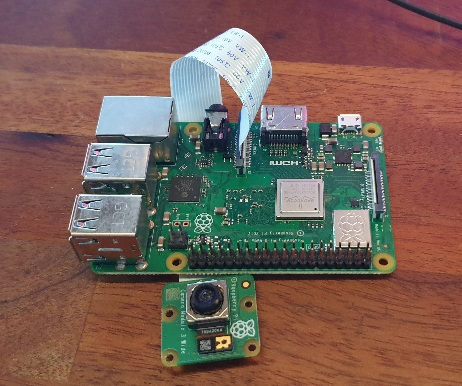
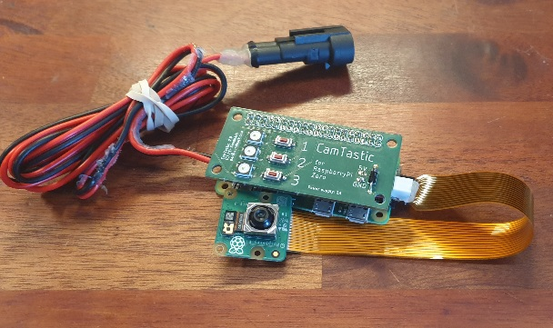
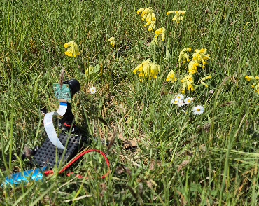
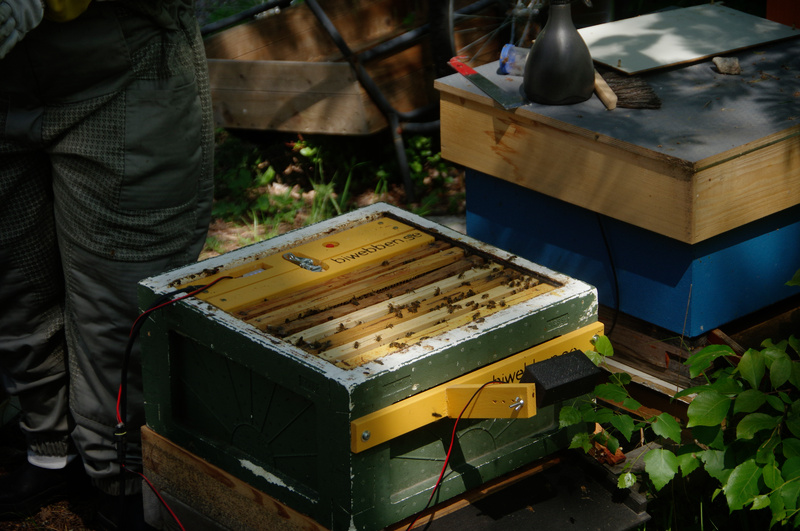

:toc:
:toc-title: Table of Contents
:toc-placement: preamble
= PyRpiCamController

A python control-software for a raspberry pi with a camera, saving or posting images. The software can also control a light (led-strip etc) and a status-indicator with some extra hardware. 

The software can be run completely locally without any internet-connection but can also post images and log-data to a backend with http(s) if configured with a correctly set up backend (examples are provided). 

It was primarily intended for collecting image-data for research or machine-learning projects but can of course be used in other applications as well.

A user-guide is found here: link:_doc/userguide.adoc[User Guide]

A document that provides a comprehensive overview of the CamController architecture, design patterns, and implementation details for developers working with or extending the PyRpiCamController systemis found here: link:_doc/CAMCONTROLLER_ARCHITECTURE.adoc[CamController Architecture Guide]

== General

The project uses python3, libcamera and picamera2 among some other packages.

The software should work with all raspberry pi's but depending on computational power some features now or in the future might not work with all raspberry pi models.

Current supported camera-types has an implementation in the CamController/Cam -module and it is fairly easy to add new camera-types here if needed. 

The system features a unified settings management system with a Swedish language web interface for easy configuration. Settings can be managed through the web interface or programmatically through configuration files.
The software is designed to be used 'headless' and installed and run as a service. 

== Project Structure

This project is licensed under the terms of the GNU General Public License v3.0. See the LICENSE file for details.
The project is structured in the following way:

=== CamController
The main application folder containing the core camera control software written in Python. This includes:

* **Main.py** - Entry point and logging configuration
* **MainLoop.py** - Main execution loop that manages different camera states
* **Cam/** - Camera interface modules supporting different camera types (PiCam3, etc.)
* **CamStates/** - State machine implementation for different camera behaviors (PostState, etc.)
* **IO/** - Input/output modules for hardware control (Display, lighting, etc.)
* **Publishers/** - Publishing modules for saving images and metadata (FilePublisher, HttpPublisher)
* **Connectivity/** - Network and connectivity management modules

=== Settings
Unified settings system provides configuration management:

* **settings_manager.py** - Central settings manager with Python interface
* **settings_schema.json** - Single source of truth for all settings definitions
* **user_settings.json** - User customizations that override defaults

=== webgui
Flask-based web interface for remote camera system configuration:

* **web_app.py** - Flask application with settings schema and web routes (Swedish language interface)
* **templates/** - HTML templates for the configuration interface
* **static/** - Static web resources (CSS, images)
* **webgui.service** - Systemd service configuration for production deployment

**Features:** Basic/Advanced tabs, Swedish language interface, password fields, real-time validation

=== Settings
Unified settings management system:

* **settings_manager.py** - Python interface for accessing and managing all settings
* **settings_schema.json** - Complete schema with defaults, validation, and UI metadata
* **user_settings.json** - User customizations that override defaults
* **UNIFIED_SETTINGS_GUIDE.adoc** - Comprehensive documentation for the settings system (link:Settings/UNIFIED_SETTINGS_GUIDE.adoc[Settings Guide])

**Features:** Schema-driven validation, web interface integration, backward compatibility

=== tools
Installation and setup utilities:

* **install-all.py** - Main installation script that sets up the entire system
* **smb.conf** - Samba configuration for network file sharing
* **pycam.service** - Systemd service file for the camera application
* **comitup.conf** - Configuration file for the Wi-Fi setup tool 'comitup'
* Various helper scripts for system configuration and deployment

=== _doc
Documentation and reference materials:

* **extra_hardware.pdf** - Circuit diagrams for optional hardware components
* **swap_instructions.adoc** - Instructions for configuring swap on Raspberry Pi Zero
* Hardware images and setup photos

=== ota
Over-The-Air update system for remote software deployment:

* **install/** - OTA daemon and installation scripts
* **ota-daemon.service** - Systemd service for background update checking
* **recovery.sh** - Recovery script for failed updates
* **OTA_GUIDE.adoc** - Complete documentation for OTA system setup and usage (link:ota/OTA_GUIDE.adoc[OTA Guide])
* **SECURITY_GUIDE.adoc** - Security considerations for OTA deployments (link:ota/SECURITY_GUIDE.adoc[Security Guide])

=== timelapse
Timelapse video creation utilities:

* **timelaps.py** - Script for creating timelapse videos from captured images

=== shared
Runtime directories for logs and captured content (created during installation)

=== backend
Server-side infrastructure for receiving images and data from the camera system when using HTTP publishing mode. Includes a comprehensive OTA (Over-The-Air) update system for remote software deployment and device management (link:backend/BACKEND.adoc[Backend Guide]).

== Currently implemented features

* Support for running from USB-stick (faster and more reliable than SD-card)
* Support for picam3 and picam3HQ (probably also picam2 and picamHQ)
* Saving still-images and meta-data at a configurable interval
* Saving the images to a shared folder on the usb-stick, shared with samba
* Can post images to a backend with http (a simple example-receive-script is provided)
* Support for motion-detection (basic implementation)
* Fully configurable from a config file via webgui or directly in the config-file
* Logging to a server with http to a configurable url
* Logging to a file in the pi
* Configurable image resolution 
* Configurable log-level
* Can control a led-strip or other light-source with PWM (needs extra hardware)
* Can control a addressable RGB LED for status indication (needs extra hardware)
* Monitors the CPU-temp and take actions if needed
* Installed and run as a Linux service
* A provided install-script for needed packages and default-settings etc
* Using WiFi management with 'commitup' from Dave Steel. 
* Tested with RPi 3B+ and Zero W but probably works for all raspberry pi models

== Planned features (upcoming)

* Video streaming to the local network (basic implementation exists)
* Support for more camera-types
* Support for an extra tempsensor inside the cam-box (needs extra hardware)
* Support for simple image-analyze with YOLO or similar
* Support for using the camera as a 'sensor' in homeassistant

== Recently implemented features

* **Unified Settings System** - Schema-driven configuration with web interface
* **Swedish Web Interface** - User-friendly configuration with basic/advanced tabs
* **OTA Update System** - Remote software deployment and management
* **Centralized Logging** - All logs accessible via network share
* **Enhanced Installation** - Complete system setup with single script 

A circuic-diagram for the needed extra hardware used for some features can be found here: link:_doc/extra_hardware.pdf["Circuit-diagram"]

== How to install and get started (the easy way)

=== Prerequisites
You need a Raspberry Pi with a camera module (picam3 or picam3HQ which is currently supported) and a WiFi connection. The software is tested with Raspberry Pi 3B, 3B+, Zero W and Zero W2 but should work with all models.

=== Clone the repo and fix settings
Clone this repository to your computer. 

=== Prepare the USB-stick or SD-card and start the pi

I prefer using a USB-stick since this is faster and more reliable than using an SD-card. Note that this only works for Raspberry Pi 3B+ and later models (and not with zero either).

Start with an image of latest Raspberry Pi OS lite 32 or 64 bit depending on model (Legacy OS will NOT work). Use Raspberry Pi imager to pre-set WiFi and hostname etc and build an image for your pi-type and write it to a USB-stick or SD-card.

When the pi starts it will automatically connect to the WiFi and get an IP-address. If you have set a hostname it will be available on the network with that name.

When the WiFi is pre-set, you can directly start 'headless', ssh to target and copy the needed

=== What files to copy
Copy these folder from the cloned repo the home-root of the pi-user. Default is /home/pi/..

/CamController, /ota, /Settings, /tools, /webgui

=== How to install the software

Note that the swap-file needs to be enlarged for zero and zero v2 before you run this or the install will fail. See detailed instructions here: link:_doc/sraspi-zero.adoc[How to adjust swap on Raspberry Pi Zero and Zero v2]

Now, run the tools/install-all.py script on your pi which will update the os and then install all needed packages and services. This will take a while. At the end the system will reboot with a new node-name (the pi cpu-serial) and the CamController will start as a service.

[source]
----
python tools/install-all.py
----

When the install is done, you will be offered to reboot and you might need to set up the network again, using the comitup captive portal.

The CamController now starts as a service and will run in the background. You can check the status with:

[source]
----
sudo systemctl status pycam.service
----
You can also check the log-file in shared/logs/ to see if everything is working as expected.
[source]
----
cat /home/pi/shared/logs/camera.log
----

== WIFI management with Comitup
The wifi is handled by the awesome software 'commitup' from Dave Steel. If the wifi doesn't find a known connection it starts an access-point and make it possible to define a new wifi-connection in a web-interface. 

https://github.com/davesteele/comitup/wiki/Installing-Comitup

== How the cam-software works
The basic function is to take pictures and publish those to a file or/and a backend.

The software uses a **unified settings system** with three key components:

* **settings_schema.json** - Defines all available settings, types, and validation rules
* **settings_manager.py** - Python interface for accessing settings programmatically
* **user_settings.json** - User customizations that override schema defaults

Configuration can be managed in two ways:
* **Web interface** - Swedish language GUI at http://localhost:5000 for user-friendly editing
* **Python code** - Direct programmatic access via the settings manager

The software acts like a 'game-loop' with a main that starts a mainloop and runs update on all activated objects. The mainloop is a while-loop that runs until the program is stopped or killed. Different behavior is implemented as different cam-states and the mainloop updates the state that is currently active.

Logging is implemented with python's logging module and the loglevel is set in the unified settings. The logging is done to a file on the pi and/or to a backend-server with http. For http a receiving-script needs to be implemented on the server-side an example is provided in the 'backend' folder.

== Changing the settings

The camera system uses a unified settings management system:

=== Web Interface (Recommended)
Access the Swedish language web interface at `http://hostname.local:8000` after installation (note: port 8000, not 5000):

* **Basic Settings Tab** - Essential configuration options for typical users
* **Advanced Settings Tab** - Advanced options for power users
* **Real-time Validation** - Immediate feedback on setting changes
* **Password Fields** - Secure handling of API keys and sensitive data

=== Settings Files
For advanced users, settings can also be managed via configuration files:

* **Settings/user_settings.json** - User customizations (recommended for programmatic changes)
* **Settings/settings_schema.json** - Complete schema with all available options

=== Documentation
Refer to `Settings/UNIFIED_SETTINGS_GUIDE.adoc` for comprehensive documentation on:

* Available settings and their purposes
* Schema structure and validation rules
* Migration from legacy configuration
* Web interface integration

== Over-The-Air Updates

The system includes a comprehensive OTA update mechanism for remote software deployment. This allows you to update the camera software without physical access to the device.

=== OTA Documentation
Refer to `ota/OTA_GUIDE.adoc` for complete documentation on:

* Setting up the OTA server infrastructure
* Configuring devices for OTA updates
* Security considerations and best practices
* Troubleshooting update issues

Refer to `ota/SECURITY_GUIDE.adoc` for security guidelines when deploying OTA updates.

== Samba file-sharing for easy access to images and logs
A samba server is installed as a part of the install-script. This makes it possible to share the images and /home/pi/shared/logs folders on the network.
This makes it easy to get the images and logs from the pi without having to ssh or use scp or similar.

== Contributing

I encourage everyone to contribute! 

Either by posting issues/bugreport/feature-request or by making pull-requests. For pull-requests, please only add one feature or bugfix for each pull-request which makes it easier to review and merge.

== Some examples of products using this software

=== A surveillance cam connected to home-assistant

A raspberry pi 3B+ using a picam3 with auto-focus. The software create a video-stream that is connected to home-assistant with the 'generic camera' integration.

=== A cam for the inside of a bee-hive

A raspberry pi 3B+ using a picam3 with a 'wide-lens' and auto-focus. The software controls a lightbox and a status-led.

=== A cam for the outside/entrance of a bee-hive

A raspberry pi Zero W using a picam3 with a 'std-lens' and auto-focus in a waterproof box. The software controls a status-led on the backside of the box.

=== A cam for arbitrary use, such as documenting insects visiting flowers

A Raspberry pi 3B+ using a picam3HQ camera on a tri-pod.

== Hardware images

=== Rpi3 with a cam

=== Zero W with a cam and extra hardware

=== Rpi with HQ cam

=== Beehive cams

