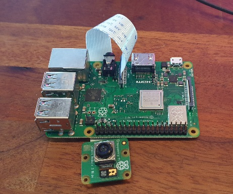

:toc:
:toc-title: Table of Contents
:toc-placement: preamble
= PyRpiCamController

A python control-software for a raspberry pi with a camera, posting images. The software can also control a light (led-strip etc) and a status-indicator with some extra hardware. 

It was primarily intended for collecting image-data for research or machine-learning projects but can ofcourse be used in other applications as well.

== General

The project uses python3, libcamera and picamera2 among some other packages.

The software should work with all raspberry pi's but depending on computational power some features now or in the future might not work with all raspberry pi models.

Current supported camera-types has an implementation in the CamController/Cam -module and it is fairly easy to add new camera-types here if needed. 

There are a lot of different settings, checkout camconfig.py. Not all are implemented yet but most of them are.
The software is designed to be used 'headless' and installed as a service. 

== Currently implemented features

* Support for Raspberry Pi Camera module 3
* Fully configurable from a config file
* Logging to a server with http to a configurable url
* Logging to a file in the pi
* Saving still-images and meta-data at a configuarble interval and send this to a configurable url for saving in backend
* Configurable image resolution 
* Configurable log-level
* Can control a led-strip or other light-source with PWM (needs extra hardware)
* Can control a addressable RGB LED for status indication (needs extra hardware)
* Monitors the CPU-temp and take actions if needed
* Can be installed and run as a Linux service
* A provided install-script for needed packages and default-settings etc
* Using WiFi management with 'commitup' from Dave Steel. 
* No writing to SD-card, all image handling in memory
* Tested with RPi 3B+ and Zero W but probably works for all raspberry pi models

== Planned features for the near future

* Video streaming to the local nework
* Configuration management from a web-site
* OTA update
* Support for more camera-types
* Support for an extra tempsensor inside the cam-box (needs extra hardware)
* Support for simple image-analyze with YOLO or similar
* Support for using the camera as a 'sensor' in homeassistant 

A circuic-diagram for the needed extra hardware used for some features can be found here: link:_doc/extra_hardware.pdf["Circuit-diagram"]

== How to install and get started (the easy way)

Start with an sd-image with latest Raspberry Pi OS lite 32 or 64 bit (Legacy OS will NOT work). Use Raspberry Pi imager to pre-set WiFi and hostname etc and build an image for your pi-type.

When the WiFi is pre-set, you can directly start 'headless', ssh to target, copy the files and run the tools/install.py script which will update the os and then install all needed packages and services. Note that the swap-file needs to be enlarged for zero and zero v2 oŕ the isntall will fail. How to adjust swap: https://pimylifeup.com/raspberry-pi-swap-file/

After a reboot you need to set up the network again, using the comitup captive portal.

== WIFI management with Comitup
The wifi is handled by the awesome software 'commitup' from Dave Steel. If the wifi doesn't find a known connection it starts an access-point and make it possible to define a new wifi-connection in a web-interface. 

https://github.com/davesteele/comitup/wiki/Installing-Comitup

== How it works
The basic function is to take pictures and send those to a backend.

There is a settings-file (camsettings.py) with a lot of different settings such as resolution, image-interval, backend-receive-script-url, loglevel etc. This file contains both the hardware settings and a default userconfig.

The software acts like a 'game-loop' with a main that starts a mainloop and run update on all activated objects. The mainloop is a while-loop that runs until the program is stopped or killed. Different behaivior is implemented as different cam-states and the mainloop updates the state that is currently active.

Logging is implemented with python's logging module and the loglevel is set in the settings-file. The logging is done to a file on the pi and/or to a backend-server with http. For http a receiving-script needs to be implemented on the server-side an exaple is provided int the 'backend' folder.

== Contributing

I encourage everyone to contribute! 

Either by posting issues/bugreport/feature-request or by making pull-requests. For pull-requests, please only add one feature or bugfix for each pull-request which makes it easier to review and merge.

== Some examples of products using this software

=== A cam for the inside of a bee-hive

A raspberry pi 3B+ using a picam3 with a 'wide-lens' and auto-focus. The software controls a lightbox and a status-led.

=== A cam for the outside/entrance of a bee-hive

A raspberry pi Zero W using a picam3 with a 'std-lens' and auto-focus in a waterproof box. The software controls a status-led on the backside of the box.

=== A cam for arbitrary use, such as documenting insects visiting flowers

A Raspberry pi 3B+ using a picam3HQ camera on a tri-pod.

== Hardware images

=== Rpi3 with a cam

=== Zero W with a cam and extra hardware

=== Rpi with HQ cam

=== Beehive cams

